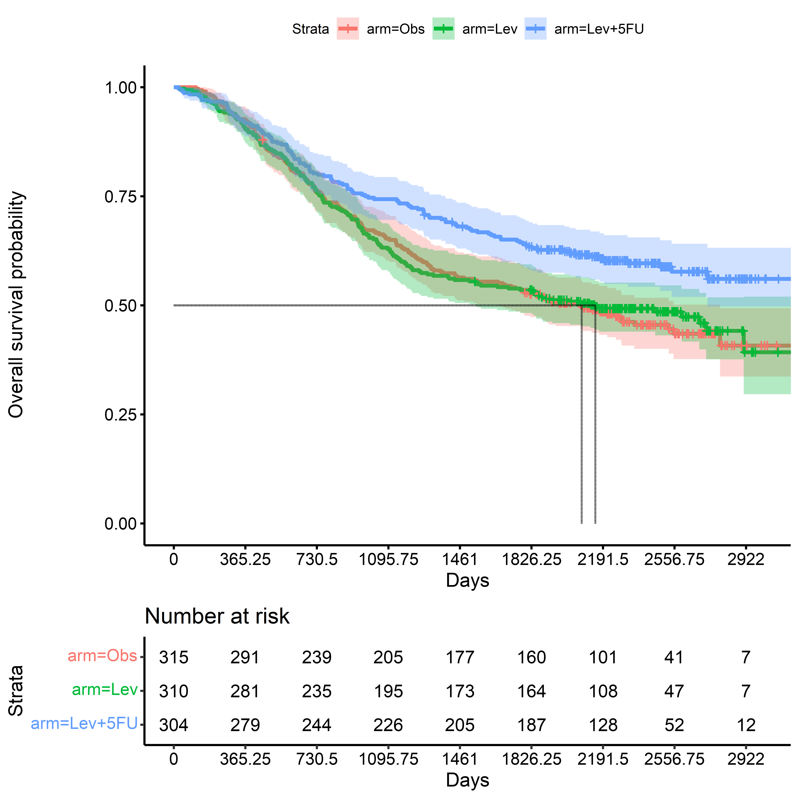
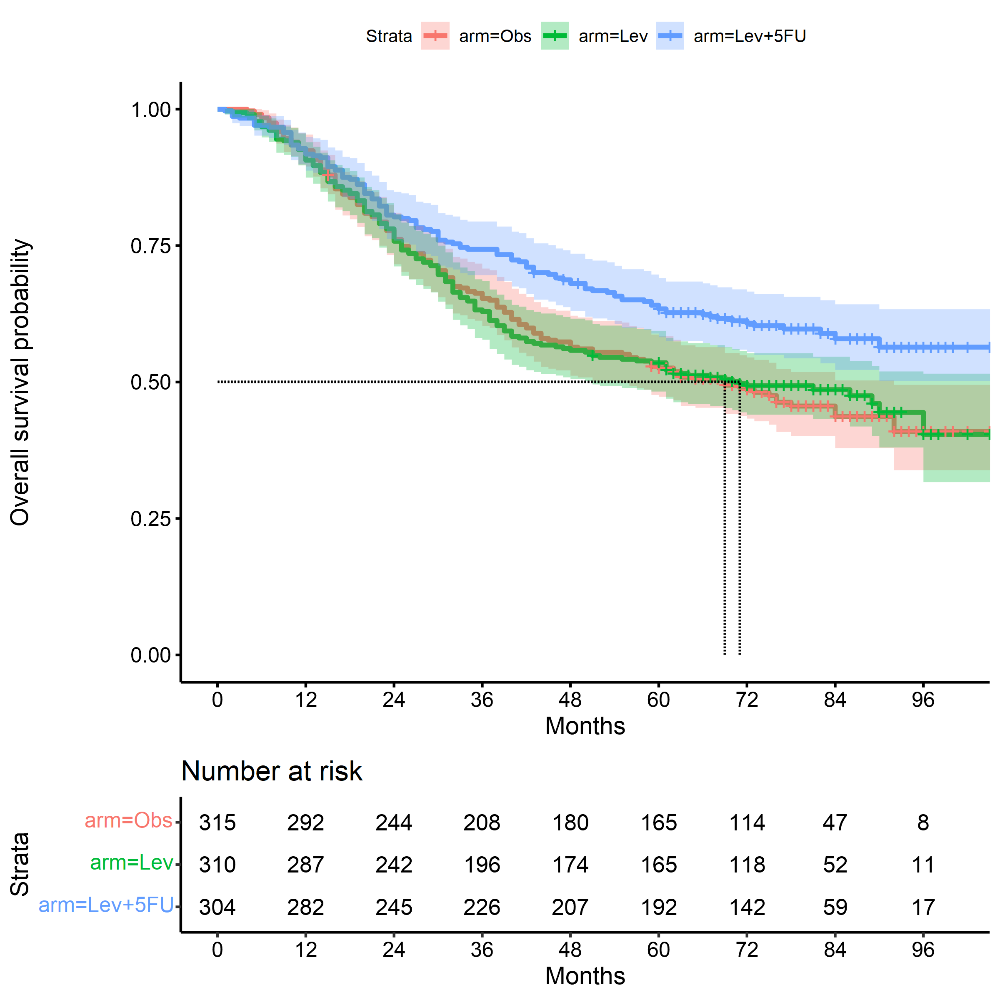
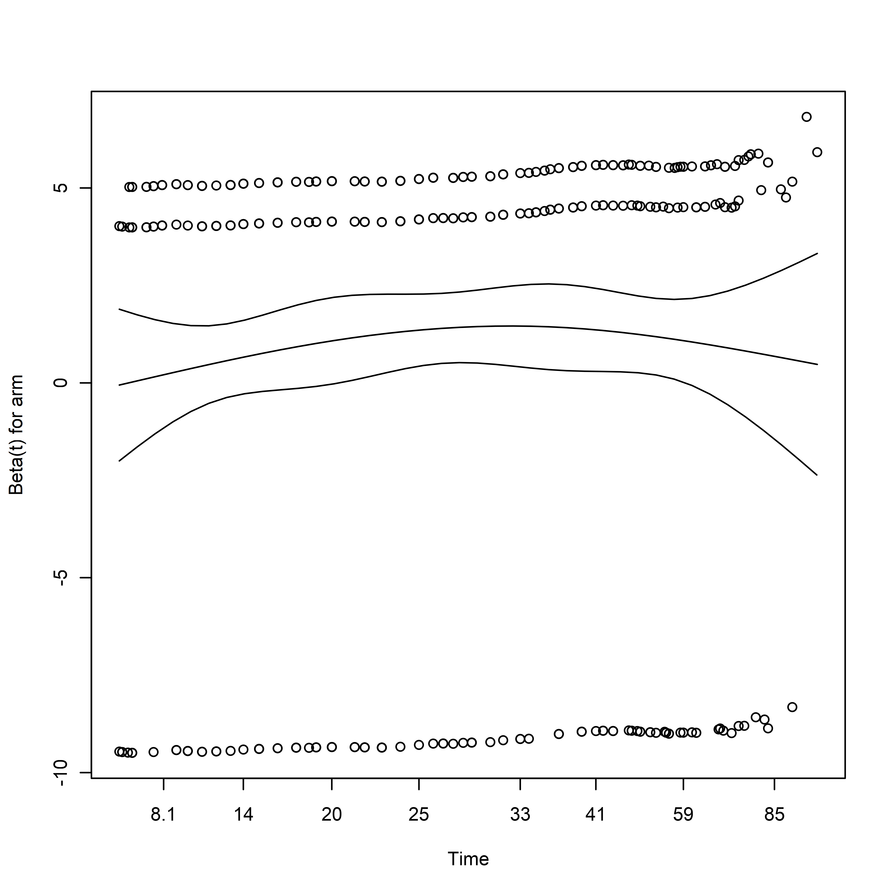

Covariate Adjustment in Randomized Trials
================
Josh Betz (<jbetz@jhu.edu>), Kelly Van Lancker (<kvanlan3@jhu.edu>), and
Michael Rosenblum (<mrosen@jhu.edu>)


-   <a href="#executive-summary" id="toc-executive-summary">Executive
    Summary</a>
-   <a href="#covariate-adjusted-analysis-in-practice"
    id="toc-covariate-adjusted-analysis-in-practice">Covariate Adjusted
    Analysis in Practice</a>
    -   <a href="#installing-rtools---compiling-packages-from-source"
        id="toc-installing-rtools---compiling-packages-from-source">Installing
        RTools - Compiling Packages from Source</a>
    -   <a href="#installing-r-packages-from-cran"
        id="toc-installing-r-packages-from-cran">Installing R Packages from
        CRAN</a>
    -   <a href="#installing-r-packages-from-github"
        id="toc-installing-r-packages-from-github">Installing R Packages from
        GitHub</a>
    -   <a href="#loading-installed-packages"
        id="toc-loading-installed-packages">Loading Installed Packages</a>
-   <a href="#chemotherapy-for-stage-bc-colon-cancer"
    id="toc-chemotherapy-for-stage-bc-colon-cancer">Chemotherapy for Stage
    B/C Colon Cancer</a>
    -   <a href="#baseline-demographics--stratum"
        id="toc-baseline-demographics--stratum">Baseline Demographics &amp;
        Stratum</a>
    -   <a href="#kaplan-meier-survival-estimate-death"
        id="toc-kaplan-meier-survival-estimate-death">Kaplan-Meier Survival
        Estimate: Death</a>
-   <a href="#checks-on-the-data" id="toc-checks-on-the-data">Checks on the
    Data:</a>
    -   <a href="#frequency-of-events" id="toc-frequency-of-events">Frequency of
        Events</a>
    -   <a href="#reference-level-for-treatment"
        id="toc-reference-level-for-treatment">Reference level for Treatment</a>
-   <a href="#unadjusted-tests--models"
    id="toc-unadjusted-tests--models">Unadjusted Tests &amp; Models</a>
    -   <a href="#log-rank-test" id="toc-log-rank-test">Log-rank Test</a>
    -   <a href="#cox-proportional-hazards-model"
        id="toc-cox-proportional-hazards-model">Cox Proportional Hazards
        Model</a>
    -   <a href="#robust-cox-proportional-hazards-model"
        id="toc-robust-cox-proportional-hazards-model">Robust Cox Proportional
        Hazards Model</a>
    -   <a href="#restricted-mean-survival-time-survrm2rmst2"
        id="toc-restricted-mean-survival-time-survrm2rmst2">Restricted Mean
        Survival Time: <code>survRM2::rmst2</code></a>
    -   <a href="#targeted-maximum-likelihood-estimator-tmle-adjrctsurvrct"
        id="toc-targeted-maximum-likelihood-estimator-tmle-adjrctsurvrct">Targeted
        Maximum Likelihood Estimator (TMLE): <code>adjrct::survrct</code></a>
-   <a href="#covariate-adjusted-analyses"
    id="toc-covariate-adjusted-analyses">Covariate Adjusted Analyses</a>
    -   <a href="#propensity-score" id="toc-propensity-score">Propensity
        Score</a>
    -   <a href="#adjusted-cox-proportional-hazards-model"
        id="toc-adjusted-cox-proportional-hazards-model">Adjusted Cox
        Proportional Hazards Model</a>
    -   <a href="#adjusted-robust-cox-proportional-hazards-model"
        id="toc-adjusted-robust-cox-proportional-hazards-model">Adjusted Robust
        Cox Proportional Hazards Model</a>
    -   <a href="#targeted-maximum-likelihood"
        id="toc-targeted-maximum-likelihood">Targeted Maximum Likelihood</a>

<style type="text/css">
.main-container {
  max-width: 100% !important;
  margin: auto;
}
</style>

## Executive Summary

Randomly allocating participants to treatment arms will tend to produce
groups that are initially comparable to one another across both observed
and unobserved factors. In any given randomized trial, there will be
some degree of imbalance in the distribution of baseline covariates
between treatment groups. When a variable is a strong predictor of the
outcome and is imbalanced across treatment arms, it represents a
potential confounding variable and source of bias, even if these
differences are not statistically significant \[@Assmann2000\].
Confounding can be addressed both in the design phase of a trial, using
stratified randomization to lessen the potential for imbalance, and in
during the analysis phase, through covariate adjustment.

Covariate adjustment can lead to a more efficient trial, potentially
lowering the required sample size to detect a given treatment effect if
it exists, or provide greater precision (shorter confidence interval
widths and higher power) for the same sample size and treatment effect.
When stratified randomization is used, covariate adjustment is generally
suggested, but not always implemented, which can lead to reduced power
and precision \[@Kahan2011\]. Accessible and practical discussions of
baseline balance, stratified randomized trials, and adjusted analyses
are also available to offer further explanation and guidance to
investigators \[@Kernan1999, @Assmann2000\].

When using regression models for inference, it is important to
understand how model misspecification may affect statistical inference.
Fortunately, there are several approaches to covariate-adjusted analyses
whose validity does not depend on a correctly specified model, or
provide inference with greater robustness to misspecification than those
used in common practice.

**The focus of this template is on the analysis of time-to-event
outcomes.** This tutorial illustrates the use of covariate-adjusted
analysis in clinical trials using an example dataset from a randomized
trial of treatments for colon cancer. This tutorial illustrates
calculating the restricted mean survival time (RMST) and survival
probability with and without adjustment for covariates. These methods
are contrasted against methods commonly used in observational studies
and randomized trials, such as the log-rank test and Cox Proportional
Hazards model.

#### Using This Tutorial

This tutorial contains an example dataset as well as code to illustrate
how to perform covariate adjustment in practice for continuous and
binary outcomes using [R](https://www.r-project.org/). R is a free and
open source language and statistical computing environment.
[Rstudio](https://rstudio.com/) is a powerful development environment
for using the R language. The ability of R can be extended by
downloading software packages from the [Comprehensive R Archival Network
(CRAN)](https://cran.r-project.org/). In R, these packages can be
installed from the Comprehensive R Archival Network, or CRAN, using the
`install.packages()` command. In Rstudio IDE, there is a ‘Packages’ tab
that allows users to see which packages are installed, which packages
are currently in use, and install or update packages using a graphical
interface. Once the required packages are installed, data can be
downloaded from Github, and users can run the code on their own devices.

## Covariate Adjusted Analysis in Practice

Once R and Rstudio have been installed, additional packages must be
installed from CRAN or Github, and some tools may need to be installed
to compile packages from source code.

### Installing RTools - Compiling Packages from Source

Some R packages must be compiled from source code.
[RTools](https://cran.r-project.org/bin/windows/Rtools/) is a set of
software tools for compiling such R packages. Choose the appropriate
version of RTools for your version of R.

### Installing R Packages from CRAN

The following packages and their dependencies needs to be installed:

-   [knitr](https://cran.r-project.org/web/packages/knitr/index.html) -
    Tools for literate programming: including code in reproducible
    reports
-   [devtools](https://cloud.r-project.org/web/packages/devtools/index.html) -
    A suite of tools for R package development
-   [tidyverse](https://www.tidyverse.org/packages/) - An ecosystem of
    packages for working with data
-   [table1](https://cran.r-project.org/web/packages/table1/index.html) -
    Creating simple tabulations in aggregate and by treatment arm
-   [survminer](https://cran.r-project.org/web/packages/survminer/index.html) -
    Creating plots of time-to-event data
-   [survRM2](https://cran.r-project.org/web/packages/survRM2/index.html) -
    Calculating the restricted mean survival time (RMST) with and
    without covariate adjustment.

``` r
required_packages <-
  c("knitr",
    "devtools",
    "tidyverse",
    "table1",
    "survminer",
    "coxrobust",
    "survRM2"
  )

install.packages(required_packages)
```

**NOTE:** Packages only need to be installed once: after installation,
they can be updated using the ‘Packages’ tab in RStudio.

### Installing R Packages from GitHub

[Github](https://github.com/) is a platform for developing software and
documentation with version control. It is a common platform for R
package development, testing, reporting and addressing software issues.
Use `devtools::install_github` to install packages hosted on Github.

``` r
devtools::install_github("nt-williams/simul")
devtools::install_github("nt-williams/adjrct")
```

### Loading Installed Packages

Once the required packages are installed, they can be loaded using
`library()` command.

``` r
library(knitr) # Printing tables in reports
library(tidyverse) # Data manipulation: dplyr, tidyr
library(table1) # Creation of Summary tables
library(survival) # For AFT & Cox Proportional Hazards Models
library(survminer) # For Kaplan-Meier Plots
library(coxrobust) # For coxr: Robust Cox PH Model
library(survRM2) # For restricted mean survival times (RMST)
library(adjrct) # For TMLE estimates of RMST, Survival Probability
library(splines) # For adding smoothing splines
```

## Chemotherapy for Stage B/C Colon Cancer

Data used in this example come from the `survival::colon` dataset, a
trial of adjuvant chemotherapy for colon cancer. See `?survival::colon`
for more details. In brief, the study had three treatment arms:
observation, levamisole, and levamisole + 5-Fluorouracil.

These data have been pre-processed to make the data more usable. Event
times were converted from long (one row per event type: recurrence
vs. death) to wide (each event as separate columns instead of rows),
categorical variables were cast as factors with named labels to make
them easier to interpret, and since some individuals were followed up
for 8 years or so, the scale of time was coarsened to months instead of
days. The code for processing the data is available
[here](https://github.com/jbetz-jhu/CovariateAdjustmentTutorial/blob/main/create_moertel_cancer_data.r)

-   `id`: Patient id
-   Baseline Covariates
    -   `arm`: Treatment - Obs(ervation), Lev(amisole),
        Lev(amisole)+5-FU
    -   `age`: Age in years
    -   `sex`: Patient Sex
    -   `obstruction`: obstruction of colon by tumor
    -   `perforation`: perforation of colon
    -   `adherence`: adherence to nearby organs
    -   `positive_nodes`: number of lymph nodes with detectable cancer
    -   `differentiation`: differentiation of tumor (`1. Well`,
        `2. Moderate`, `3. Poor`)
    -   `extent`: Extent of local spread (`1. Submucosa`, `2. Muscle`,
        `3. Serosa`, `4. Contiguous structures`)
    -   `time_surgery_registration`: time from surgery to registration
-   Outcome:
    -   `event_recurrence`: Observed (1) or Censored (0)
    -   `time_to_recurrence`: days until recurrence event
    -   `months_to_recurrence`: months until recurrence event
    -   `event_death`: Observed (1) or Censored (0)
    -   `time_to_death`: days until recurrence event
    -   `months_to_death`: months until recurrence event
    -   `event_composite`: Observed death OR recurrence (1) or neither
        event (0)
    -   `time_to_composite`: days until first composite event or
        censoring time
    -   `months_to_composite`: days until first composite event or
        censoring time

Since some functions require a binary treatment indicator and the study
contains three arms, we can create a dataset for each binary treatment
comparison of interest:

``` r
# Datasets with Binary Treatment ###############################################
# LEV vs Obs
colon_cancer_lev_vs_obs <-
  colon_cancer %>% 
  dplyr::filter(
    arm %in% c("Lev", "Obs")
  ) %>% 
  dplyr::mutate(
    tx = as.integer(1*(arm == "Lev"))
  )


# LEV+5FU vs LEV
colon_cancer_lev5fu_vs_lev <-
  colon_cancer %>% 
  dplyr::filter(
    arm %in% c("Lev", "Lev+5FU")
  ) %>% 
  dplyr::mutate(
    tx = as.integer(1*(arm == "Lev+5FU"))
  )


# LEV+5FU vs Obs
colon_cancer_lev5fu_vs_obs <-
  colon_cancer %>% 
  dplyr::filter(
    arm %in% c("Obs", "Lev+5FU")
  ) %>% 
  dplyr::mutate(
    tx = as.integer(1*(arm == "Lev+5FU"))
  )
```

### Baseline Demographics & Stratum

Below are summary statistics of participant characteristics at baseline.

``` r
table1(
  ~ age + sex + obstruction + perforation + organ_adherence +
    differentiation + local_spread + time_surgery_registration +
    positive_nodes + recurrence + death + composite | arm, 
  data = colon_cancer_original
)
```

<table class="Rtable1">
<thead>
<tr>
<th class="rowlabel firstrow lastrow">
</th>
<th class="firstrow lastrow">
<span class="stratlabel">Obs<br><span
class="stratn">(N=315)</span></span>
</th>
<th class="firstrow lastrow">
<span class="stratlabel">Lev<br><span
class="stratn">(N=310)</span></span>
</th>
<th class="firstrow lastrow">
<span class="stratlabel">Lev+5FU<br><span
class="stratn">(N=304)</span></span>
</th>
<th class="firstrow lastrow">
<span class="stratlabel">Overall<br><span
class="stratn">(N=929)</span></span>
</th>
</tr>
</thead>
<tbody>
<tr>
<td class="rowlabel firstrow">
age
</td>
<td class="firstrow">
</td>
<td class="firstrow">
</td>
<td class="firstrow">
</td>
<td class="firstrow">
</td>
</tr>
<tr>
<td class="rowlabel">
Mean (SD)
</td>
<td>
59.5 (12.0)
</td>
<td>
60.1 (11.6)
</td>
<td>
59.7 (12.3)
</td>
<td>
59.8 (11.9)
</td>
</tr>
<tr>
<td class="rowlabel lastrow">
Median (Min, Max)
</td>
<td class="lastrow">
60.0 (18.0, 85.0)
</td>
<td class="lastrow">
61.0 (27.0, 83.0)
</td>
<td class="lastrow">
62.0 (26.0, 81.0)
</td>
<td class="lastrow">
61.0 (18.0, 85.0)
</td>
</tr>
<tr>
<td class="rowlabel firstrow">
sex
</td>
<td class="firstrow">
</td>
<td class="firstrow">
</td>
<td class="firstrow">
</td>
<td class="firstrow">
</td>
</tr>
<tr>
<td class='rowlabel'>

0.  Female
    </td>
    <td>
    149 (47.3%)
    </td>
    <td>
    133 (42.9%)
    </td>
    <td>
    163 (53.6%)
    </td>
    <td>
    445 (47.9%)
    </td>
    </tr>
    <tr>
    <td class='rowlabel lastrow'>

    1.  Male
        </td>
        <td class="lastrow">
        166 (52.7%)
        </td>
        <td class="lastrow">
        177 (57.1%)
        </td>
        <td class="lastrow">
        141 (46.4%)
        </td>
        <td class="lastrow">
        484 (52.1%)
        </td>
        </tr>
        <tr>
        <td class="rowlabel firstrow">
        obstruction
        </td>
        <td class="firstrow">
        </td>
        <td class="firstrow">
        </td>
        <td class="firstrow">
        </td>
        <td class="firstrow">
        </td>
        </tr>
        <tr>
        <td class='rowlabel'>

        0.  No
            </td>
            <td>
            252 (80.0%)
            </td>
            <td>
            247 (79.7%)
            </td>
            <td>
            250 (82.2%)
            </td>
            <td>
            749 (80.6%)
            </td>
            </tr>
            <tr>
            <td class='rowlabel lastrow'>

            1.  Yes
                </td>
                <td class="lastrow">
                63 (20.0%)
                </td>
                <td class="lastrow">
                63 (20.3%)
                </td>
                <td class="lastrow">
                54 (17.8%)
                </td>
                <td class="lastrow">
                180 (19.4%)
                </td>
                </tr>
                <tr>
                <td class="rowlabel firstrow">
                perforation
                </td>
                <td class="firstrow">
                </td>
                <td class="firstrow">
                </td>
                <td class="firstrow">
                </td>
                <td class="firstrow">
                </td>
                </tr>
                <tr>
                <td class='rowlabel'>

                0.  No
                    </td>
                    <td>
                    306 (97.1%)
                    </td>
                    <td>
                    300 (96.8%)
                    </td>
                    <td>
                    296 (97.4%)
                    </td>
                    <td>
                    902 (97.1%)
                    </td>
                    </tr>
                    <tr>
                    <td class='rowlabel lastrow'>

                    1.  Yes
                        </td>
                        <td class="lastrow">
                        9 (2.9%)
                        </td>
                        <td class="lastrow">
                        10 (3.2%)
                        </td>
                        <td class="lastrow">
                        8 (2.6%)
                        </td>
                        <td class="lastrow">
                        27 (2.9%)
                        </td>
                        </tr>
                        <tr>
                        <td class="rowlabel firstrow">
                        organ_adherence
                        </td>
                        <td class="firstrow">
                        </td>
                        <td class="firstrow">
                        </td>
                        <td class="firstrow">
                        </td>
                        <td class="firstrow">
                        </td>
                        </tr>
                        <tr>
                        <td class='rowlabel'>

                        0.  No
                            </td>
                            <td>
                            268 (85.1%)
                            </td>
                            <td>
                            261 (84.2%)
                            </td>
                            <td>
                            265 (87.2%)
                            </td>
                            <td>
                            794 (85.5%)
                            </td>
                            </tr>
                            <tr>
                            <td class='rowlabel lastrow'>

                            1.  Yes
                                </td>
                                <td class="lastrow">
                                47 (14.9%)
                                </td>
                                <td class="lastrow">
                                49 (15.8%)
                                </td>
                                <td class="lastrow">
                                39 (12.8%)
                                </td>
                                <td class="lastrow">
                                135 (14.5%)
                                </td>
                                </tr>
                                <tr>
                                <td class="rowlabel firstrow">
                                differentiation
                                </td>
                                <td class="firstrow">
                                </td>
                                <td class="firstrow">
                                </td>
                                <td class="firstrow">
                                </td>
                                <td class="firstrow">
                                </td>
                                </tr>
                                <tr>
                                <td class='rowlabel'>

                                1.  Well
                                    </td>
                                    <td>
                                    27 (8.6%)
                                    </td>
                                    <td>
                                    37 (11.9%)
                                    </td>
                                    <td>
                                    29 (9.5%)
                                    </td>
                                    <td>
                                    93 (10.0%)
                                    </td>
                                    </tr>
                                    <tr>
                                    <td class='rowlabel'>

                                    2.  Moderate
                                        </td>
                                        <td>
                                        229 (72.7%)
                                        </td>
                                        <td>
                                        219 (70.6%)
                                        </td>
                                        <td>
                                        215 (70.7%)
                                        </td>
                                        <td>
                                        663 (71.4%)
                                        </td>
                                        </tr>
                                        <tr>
                                        <td class='rowlabel'>

                                        3.  Poor
                                            </td>
                                            <td>
                                            52 (16.5%)
                                            </td>
                                            <td>
                                            44 (14.2%)
                                            </td>
                                            <td>
                                            54 (17.8%)
                                            </td>
                                            <td>
                                            150 (16.1%)
                                            </td>
                                            </tr>
                                            <tr>
                                            <td class="rowlabel lastrow">
                                            Missing
                                            </td>
                                            <td class="lastrow">
                                            7 (2.2%)
                                            </td>
                                            <td class="lastrow">
                                            10 (3.2%)
                                            </td>
                                            <td class="lastrow">
                                            6 (2.0%)
                                            </td>
                                            <td class="lastrow">
                                            23 (2.5%)
                                            </td>
                                            </tr>
                                            <tr>
                                            <td class="rowlabel firstrow">
                                            local_spread
                                            </td>
                                            <td class="firstrow">
                                            </td>
                                            <td class="firstrow">
                                            </td>
                                            <td class="firstrow">
                                            </td>
                                            <td class="firstrow">
                                            </td>
                                            </tr>
                                            <tr>
                                            <td class='rowlabel'>

                                            1.  Submucosa
                                                </td>
                                                <td>
                                                8 (2.5%)
                                                </td>
                                                <td>
                                                3 (1.0%)
                                                </td>
                                                <td>
                                                10 (3.3%)
                                                </td>
                                                <td>
                                                21 (2.3%)
                                                </td>
                                                </tr>
                                                <tr>
                                                <td class='rowlabel'>

                                                2.  Muscle
                                                    </td>
                                                    <td>
                                                    38 (12.1%)
                                                    </td>
                                                    <td>
                                                    36 (11.6%)
                                                    </td>
                                                    <td>
                                                    32 (10.5%)
                                                    </td>
                                                    <td>
                                                    106 (11.4%)
                                                    </td>
                                                    </tr>
                                                    <tr>
                                                    <td class='rowlabel'>

                                                    3.  Serosa
                                                        </td>
                                                        <td>
                                                        249 (79.0%)
                                                        </td>
                                                        <td>
                                                        259 (83.5%)
                                                        </td>
                                                        <td>
                                                        251 (82.6%)
                                                        </td>
                                                        <td>
                                                        759 (81.7%)
                                                        </td>
                                                        </tr>
                                                        <tr>
                                                        <td class='rowlabel lastrow'>

                                                        4.  Contiguous
                                                            structures
                                                            </td>
                                                            <td class="lastrow">
                                                            20 (6.3%)
                                                            </td>
                                                            <td class="lastrow">
                                                            12 (3.9%)
                                                            </td>
                                                            <td class="lastrow">
                                                            11 (3.6%)
                                                            </td>
                                                            <td class="lastrow">
                                                            43 (4.6%)
                                                            </td>
                                                            </tr>
                                                            <tr>
                                                            <td class="rowlabel firstrow">
                                                            time_surgery_registration
                                                            </td>
                                                            <td class="firstrow">
                                                            </td>
                                                            <td class="firstrow">
                                                            </td>
                                                            <td class="firstrow">
                                                            </td>
                                                            <td class="firstrow">
                                                            </td>
                                                            </tr>
                                                            <tr>
                                                            <td class='rowlabel'>

                                                            0.  Short
                                                                </td>
                                                                <td>
                                                                224
                                                                (71.1%)
                                                                </td>
                                                                <td>
                                                                230
                                                                (74.2%)
                                                                </td>
                                                                <td>
                                                                228
                                                                (75.0%)
                                                                </td>
                                                                <td>
                                                                682
                                                                (73.4%)
                                                                </td>
                                                                </tr>
                                                                <tr>
                                                                <td class='rowlabel lastrow'>

                                                                1.  Long
                                                                    </td>
                                                                    <td class="lastrow">
                                                                    91
                                                                    (28.9%)
                                                                    </td>
                                                                    <td class="lastrow">
                                                                    80
                                                                    (25.8%)
                                                                    </td>
                                                                    <td class="lastrow">
                                                                    76
                                                                    (25.0%)
                                                                    </td>
                                                                    <td class="lastrow">
                                                                    247
                                                                    (26.6%)
                                                                    </td>
                                                                    </tr>
                                                                    <tr>
                                                                    <td class="rowlabel firstrow">
                                                                    positive_nodes
                                                                    </td>
                                                                    <td class="firstrow">
                                                                    </td>
                                                                    <td class="firstrow">
                                                                    </td>
                                                                    <td class="firstrow">
                                                                    </td>
                                                                    <td class="firstrow">
                                                                    </td>
                                                                    </tr>
                                                                    <tr>
                                                                    <td class="rowlabel">
                                                                    Mean
                                                                    (SD)
                                                                    </td>
                                                                    <td>
                                                                    3.79
                                                                    (3.73)
                                                                    </td>
                                                                    <td>
                                                                    3.69
                                                                    (3.56)
                                                                    </td>
                                                                    <td>
                                                                    3.49
                                                                    (3.42)
                                                                    </td>
                                                                    <td>
                                                                    3.66
                                                                    (3.57)
                                                                    </td>
                                                                    </tr>
                                                                    <tr>
                                                                    <td class="rowlabel">
                                                                    Median
                                                                    (Min,
                                                                    Max)
                                                                    </td>
                                                                    <td>
                                                                    2.00
                                                                    (0,
                                                                    27.0)
                                                                    </td>
                                                                    <td>
                                                                    2.00
                                                                    (0,
                                                                    33.0)
                                                                    </td>
                                                                    <td>
                                                                    2.00
                                                                    (1.00,
                                                                    24.0)
                                                                    </td>
                                                                    <td>
                                                                    2.00
                                                                    (0,
                                                                    33.0)
                                                                    </td>
                                                                    </tr>
                                                                    <tr>
                                                                    <td class="rowlabel lastrow">
                                                                    Missing
                                                                    </td>
                                                                    <td class="lastrow">
                                                                    3
                                                                    (1.0%)
                                                                    </td>
                                                                    <td class="lastrow">
                                                                    6
                                                                    (1.9%)
                                                                    </td>
                                                                    <td class="lastrow">
                                                                    9
                                                                    (3.0%)
                                                                    </td>
                                                                    <td class="lastrow">
                                                                    18
                                                                    (1.9%)
                                                                    </td>
                                                                    </tr>
                                                                    <tr>
                                                                    <td class="rowlabel firstrow">
                                                                    recurrence
                                                                    </td>
                                                                    <td class="firstrow">
                                                                    </td>
                                                                    <td class="firstrow">
                                                                    </td>
                                                                    <td class="firstrow">
                                                                    </td>
                                                                    <td class="firstrow">
                                                                    </td>
                                                                    </tr>
                                                                    <tr>
                                                                    <td class='rowlabel'>

                                                                    0.  No
                                                                        </td>
                                                                        <td>
                                                                        138
                                                                        (43.8%)
                                                                        </td>
                                                                        <td>
                                                                        138
                                                                        (44.5%)
                                                                        </td>
                                                                        <td>
                                                                        185
                                                                        (60.9%)
                                                                        </td>
                                                                        <td>
                                                                        461
                                                                        (49.6%)
                                                                        </td>
                                                                        </tr>
                                                                        <tr>
                                                                        <td class='rowlabel lastrow'>

                                                                        1.  Yes
                                                                            </td>
                                                                            <td class="lastrow">
                                                                            177
                                                                            (56.2%)
                                                                            </td>
                                                                            <td class="lastrow">
                                                                            172
                                                                            (55.5%)
                                                                            </td>
                                                                            <td class="lastrow">
                                                                            119
                                                                            (39.1%)
                                                                            </td>
                                                                            <td class="lastrow">
                                                                            468
                                                                            (50.4%)
                                                                            </td>
                                                                            </tr>
                                                                            <tr>
                                                                            <td class="rowlabel firstrow">
                                                                            death
                                                                            </td>
                                                                            <td class="firstrow">
                                                                            </td>
                                                                            <td class="firstrow">
                                                                            </td>
                                                                            <td class="firstrow">
                                                                            </td>
                                                                            <td class="firstrow">
                                                                            </td>
                                                                            </tr>
                                                                            <tr>
                                                                            <td class='rowlabel'>

                                                                            0.  No
                                                                                </td>
                                                                                <td>
                                                                                147
                                                                                (46.7%)
                                                                                </td>
                                                                                <td>
                                                                                149
                                                                                (48.1%)
                                                                                </td>
                                                                                <td>
                                                                                181
                                                                                (59.5%)
                                                                                </td>
                                                                                <td>
                                                                                477
                                                                                (51.3%)
                                                                                </td>
                                                                                </tr>
                                                                                <tr>
                                                                                <td class='rowlabel lastrow'>

                                                                                1.  Yes
                                                                                    </td>
                                                                                    <td class="lastrow">
                                                                                    168
                                                                                    (53.3%)
                                                                                    </td>
                                                                                    <td class="lastrow">
                                                                                    161
                                                                                    (51.9%)
                                                                                    </td>
                                                                                    <td class="lastrow">
                                                                                    123
                                                                                    (40.5%)
                                                                                    </td>
                                                                                    <td class="lastrow">
                                                                                    452
                                                                                    (48.7%)
                                                                                    </td>
                                                                                    </tr>
                                                                                    <tr>
                                                                                    <td class="rowlabel firstrow">
                                                                                    composite
                                                                                    </td>
                                                                                    <td class="firstrow">
                                                                                    </td>
                                                                                    <td class="firstrow">
                                                                                    </td>
                                                                                    <td class="firstrow">
                                                                                    </td>
                                                                                    <td class="firstrow">
                                                                                    </td>
                                                                                    </tr>
                                                                                    <tr>
                                                                                    <td class='rowlabel'>

                                                                                    0.  No
                                                                                        </td>
                                                                                        <td>
                                                                                        125
                                                                                        (39.7%)
                                                                                        </td>
                                                                                        <td>
                                                                                        128
                                                                                        (41.3%)
                                                                                        </td>
                                                                                        <td>
                                                                                        170
                                                                                        (55.9%)
                                                                                        </td>
                                                                                        <td>
                                                                                        423
                                                                                        (45.5%)
                                                                                        </td>
                                                                                        </tr>
                                                                                        <tr>
                                                                                        <td class='rowlabel lastrow'>

                                                                                        1.  Yes
                                                                                            </td>
                                                                                            <td class="lastrow">
                                                                                            190
                                                                                            (60.3%)
                                                                                            </td>
                                                                                            <td class="lastrow">
                                                                                            182
                                                                                            (58.7%)
                                                                                            </td>
                                                                                            <td class="lastrow">
                                                                                            134
                                                                                            (44.1%)
                                                                                            </td>
                                                                                            <td class="lastrow">
                                                                                            506
                                                                                            (54.5%)
                                                                                            </td>
                                                                                            </tr>
                                                                                            </tbody>
                                                                                            </table>

Note that `differentiation` and `positive_nodes` contain missing values,
which must be imputed. If there are any missing covariates, observations
may be dropped from analyses, or these may cause errors in other
functions.

Below are summary statistics of participant characteristics at baseline
*after* imputing missing baseline covariates.

``` r
table1(
  ~ age + sex + obstruction + perforation + organ_adherence +
    differentiation + local_spread + time_surgery_registration +
    positive_nodes + recurrence + death + composite | arm, 
  data = colon_cancer
)
```

<table class="Rtable1">
<thead>
<tr>
<th class="rowlabel firstrow lastrow">
</th>
<th class="firstrow lastrow">
<span class="stratlabel">Obs<br><span
class="stratn">(N=315)</span></span>
</th>
<th class="firstrow lastrow">
<span class="stratlabel">Lev<br><span
class="stratn">(N=310)</span></span>
</th>
<th class="firstrow lastrow">
<span class="stratlabel">Lev+5FU<br><span
class="stratn">(N=304)</span></span>
</th>
<th class="firstrow lastrow">
<span class="stratlabel">Overall<br><span
class="stratn">(N=929)</span></span>
</th>
</tr>
</thead>
<tbody>
<tr>
<td class="rowlabel firstrow">
age
</td>
<td class="firstrow">
</td>
<td class="firstrow">
</td>
<td class="firstrow">
</td>
<td class="firstrow">
</td>
</tr>
<tr>
<td class="rowlabel">
Mean (SD)
</td>
<td>
59.5 (12.0)
</td>
<td>
60.1 (11.6)
</td>
<td>
59.7 (12.3)
</td>
<td>
59.8 (11.9)
</td>
</tr>
<tr>
<td class="rowlabel lastrow">
Median (Min, Max)
</td>
<td class="lastrow">
60.0 (18.0, 85.0)
</td>
<td class="lastrow">
61.0 (27.0, 83.0)
</td>
<td class="lastrow">
62.0 (26.0, 81.0)
</td>
<td class="lastrow">
61.0 (18.0, 85.0)
</td>
</tr>
<tr>
<td class="rowlabel firstrow">
sex
</td>
<td class="firstrow">
</td>
<td class="firstrow">
</td>
<td class="firstrow">
</td>
<td class="firstrow">
</td>
</tr>
<tr>
<td class='rowlabel'>

0.  Female
    </td>
    <td>
    149 (47.3%)
    </td>
    <td>
    133 (42.9%)
    </td>
    <td>
    163 (53.6%)
    </td>
    <td>
    445 (47.9%)
    </td>
    </tr>
    <tr>
    <td class='rowlabel lastrow'>

    1.  Male
        </td>
        <td class="lastrow">
        166 (52.7%)
        </td>
        <td class="lastrow">
        177 (57.1%)
        </td>
        <td class="lastrow">
        141 (46.4%)
        </td>
        <td class="lastrow">
        484 (52.1%)
        </td>
        </tr>
        <tr>
        <td class="rowlabel firstrow">
        obstruction
        </td>
        <td class="firstrow">
        </td>
        <td class="firstrow">
        </td>
        <td class="firstrow">
        </td>
        <td class="firstrow">
        </td>
        </tr>
        <tr>
        <td class='rowlabel'>

        0.  No
            </td>
            <td>
            252 (80.0%)
            </td>
            <td>
            247 (79.7%)
            </td>
            <td>
            250 (82.2%)
            </td>
            <td>
            749 (80.6%)
            </td>
            </tr>
            <tr>
            <td class='rowlabel lastrow'>

            1.  Yes
                </td>
                <td class="lastrow">
                63 (20.0%)
                </td>
                <td class="lastrow">
                63 (20.3%)
                </td>
                <td class="lastrow">
                54 (17.8%)
                </td>
                <td class="lastrow">
                180 (19.4%)
                </td>
                </tr>
                <tr>
                <td class="rowlabel firstrow">
                perforation
                </td>
                <td class="firstrow">
                </td>
                <td class="firstrow">
                </td>
                <td class="firstrow">
                </td>
                <td class="firstrow">
                </td>
                </tr>
                <tr>
                <td class='rowlabel'>

                0.  No
                    </td>
                    <td>
                    306 (97.1%)
                    </td>
                    <td>
                    300 (96.8%)
                    </td>
                    <td>
                    296 (97.4%)
                    </td>
                    <td>
                    902 (97.1%)
                    </td>
                    </tr>
                    <tr>
                    <td class='rowlabel lastrow'>

                    1.  Yes
                        </td>
                        <td class="lastrow">
                        9 (2.9%)
                        </td>
                        <td class="lastrow">
                        10 (3.2%)
                        </td>
                        <td class="lastrow">
                        8 (2.6%)
                        </td>
                        <td class="lastrow">
                        27 (2.9%)
                        </td>
                        </tr>
                        <tr>
                        <td class="rowlabel firstrow">
                        organ_adherence
                        </td>
                        <td class="firstrow">
                        </td>
                        <td class="firstrow">
                        </td>
                        <td class="firstrow">
                        </td>
                        <td class="firstrow">
                        </td>
                        </tr>
                        <tr>
                        <td class='rowlabel'>

                        0.  No
                            </td>
                            <td>
                            268 (85.1%)
                            </td>
                            <td>
                            261 (84.2%)
                            </td>
                            <td>
                            265 (87.2%)
                            </td>
                            <td>
                            794 (85.5%)
                            </td>
                            </tr>
                            <tr>
                            <td class='rowlabel lastrow'>

                            1.  Yes
                                </td>
                                <td class="lastrow">
                                47 (14.9%)
                                </td>
                                <td class="lastrow">
                                49 (15.8%)
                                </td>
                                <td class="lastrow">
                                39 (12.8%)
                                </td>
                                <td class="lastrow">
                                135 (14.5%)
                                </td>
                                </tr>
                                <tr>
                                <td class="rowlabel firstrow">
                                differentiation
                                </td>
                                <td class="firstrow">
                                </td>
                                <td class="firstrow">
                                </td>
                                <td class="firstrow">
                                </td>
                                <td class="firstrow">
                                </td>
                                </tr>
                                <tr>
                                <td class='rowlabel'>

                                1.  Well
                                    </td>
                                    <td>
                                    27 (8.6%)
                                    </td>
                                    <td>
                                    37 (11.9%)
                                    </td>
                                    <td>
                                    29 (9.5%)
                                    </td>
                                    <td>
                                    93 (10.0%)
                                    </td>
                                    </tr>
                                    <tr>
                                    <td class='rowlabel'>

                                    2.  Moderate
                                        </td>
                                        <td>
                                        235 (74.6%)
                                        </td>
                                        <td>
                                        228 (73.5%)
                                        </td>
                                        <td>
                                        220 (72.4%)
                                        </td>
                                        <td>
                                        683 (73.5%)
                                        </td>
                                        </tr>
                                        <tr>
                                        <td class='rowlabel lastrow'>

                                        3.  Poor
                                            </td>
                                            <td class="lastrow">
                                            53 (16.8%)
                                            </td>
                                            <td class="lastrow">
                                            45 (14.5%)
                                            </td>
                                            <td class="lastrow">
                                            55 (18.1%)
                                            </td>
                                            <td class="lastrow">
                                            153 (16.5%)
                                            </td>
                                            </tr>
                                            <tr>
                                            <td class="rowlabel firstrow">
                                            local_spread
                                            </td>
                                            <td class="firstrow">
                                            </td>
                                            <td class="firstrow">
                                            </td>
                                            <td class="firstrow">
                                            </td>
                                            <td class="firstrow">
                                            </td>
                                            </tr>
                                            <tr>
                                            <td class='rowlabel'>

                                            1.  Submucosa
                                                </td>
                                                <td>
                                                8 (2.5%)
                                                </td>
                                                <td>
                                                3 (1.0%)
                                                </td>
                                                <td>
                                                10 (3.3%)
                                                </td>
                                                <td>
                                                21 (2.3%)
                                                </td>
                                                </tr>
                                                <tr>
                                                <td class='rowlabel'>

                                                2.  Muscle
                                                    </td>
                                                    <td>
                                                    38 (12.1%)
                                                    </td>
                                                    <td>
                                                    36 (11.6%)
                                                    </td>
                                                    <td>
                                                    32 (10.5%)
                                                    </td>
                                                    <td>
                                                    106 (11.4%)
                                                    </td>
                                                    </tr>
                                                    <tr>
                                                    <td class='rowlabel'>

                                                    3.  Serosa
                                                        </td>
                                                        <td>
                                                        249 (79.0%)
                                                        </td>
                                                        <td>
                                                        259 (83.5%)
                                                        </td>
                                                        <td>
                                                        251 (82.6%)
                                                        </td>
                                                        <td>
                                                        759 (81.7%)
                                                        </td>
                                                        </tr>
                                                        <tr>
                                                        <td class='rowlabel lastrow'>

                                                        4.  Contiguous
                                                            structures
                                                            </td>
                                                            <td class="lastrow">
                                                            20 (6.3%)
                                                            </td>
                                                            <td class="lastrow">
                                                            12 (3.9%)
                                                            </td>
                                                            <td class="lastrow">
                                                            11 (3.6%)
                                                            </td>
                                                            <td class="lastrow">
                                                            43 (4.6%)
                                                            </td>
                                                            </tr>
                                                            <tr>
                                                            <td class="rowlabel firstrow">
                                                            time_surgery_registration
                                                            </td>
                                                            <td class="firstrow">
                                                            </td>
                                                            <td class="firstrow">
                                                            </td>
                                                            <td class="firstrow">
                                                            </td>
                                                            <td class="firstrow">
                                                            </td>
                                                            </tr>
                                                            <tr>
                                                            <td class='rowlabel'>

                                                            0.  Short
                                                                </td>
                                                                <td>
                                                                224
                                                                (71.1%)
                                                                </td>
                                                                <td>
                                                                230
                                                                (74.2%)
                                                                </td>
                                                                <td>
                                                                228
                                                                (75.0%)
                                                                </td>
                                                                <td>
                                                                682
                                                                (73.4%)
                                                                </td>
                                                                </tr>
                                                                <tr>
                                                                <td class='rowlabel lastrow'>

                                                                1.  Long
                                                                    </td>
                                                                    <td class="lastrow">
                                                                    91
                                                                    (28.9%)
                                                                    </td>
                                                                    <td class="lastrow">
                                                                    80
                                                                    (25.8%)
                                                                    </td>
                                                                    <td class="lastrow">
                                                                    76
                                                                    (25.0%)
                                                                    </td>
                                                                    <td class="lastrow">
                                                                    247
                                                                    (26.6%)
                                                                    </td>
                                                                    </tr>
                                                                    <tr>
                                                                    <td class="rowlabel firstrow">
                                                                    positive_nodes
                                                                    </td>
                                                                    <td class="firstrow">
                                                                    </td>
                                                                    <td class="firstrow">
                                                                    </td>
                                                                    <td class="firstrow">
                                                                    </td>
                                                                    <td class="firstrow">
                                                                    </td>
                                                                    </tr>
                                                                    <tr>
                                                                    <td class="rowlabel">
                                                                    Mean
                                                                    (SD)
                                                                    </td>
                                                                    <td>
                                                                    3.80
                                                                    (3.74)
                                                                    </td>
                                                                    <td>
                                                                    3.71
                                                                    (3.56)
                                                                    </td>
                                                                    <td>
                                                                    3.51
                                                                    (3.41)
                                                                    </td>
                                                                    <td>
                                                                    3.68
                                                                    (3.57)
                                                                    </td>
                                                                    </tr>
                                                                    <tr>
                                                                    <td class="rowlabel lastrow">
                                                                    Median
                                                                    (Min,
                                                                    Max)
                                                                    </td>
                                                                    <td class="lastrow">
                                                                    2.00
                                                                    (0,
                                                                    27.0)
                                                                    </td>
                                                                    <td class="lastrow">
                                                                    2.00
                                                                    (0,
                                                                    33.0)
                                                                    </td>
                                                                    <td class="lastrow">
                                                                    2.00
                                                                    (1.00,
                                                                    24.0)
                                                                    </td>
                                                                    <td class="lastrow">
                                                                    2.00
                                                                    (0,
                                                                    33.0)
                                                                    </td>
                                                                    </tr>
                                                                    <tr>
                                                                    <td class="rowlabel firstrow">
                                                                    recurrence
                                                                    </td>
                                                                    <td class="firstrow">
                                                                    </td>
                                                                    <td class="firstrow">
                                                                    </td>
                                                                    <td class="firstrow">
                                                                    </td>
                                                                    <td class="firstrow">
                                                                    </td>
                                                                    </tr>
                                                                    <tr>
                                                                    <td class='rowlabel'>

                                                                    0.  No
                                                                        </td>
                                                                        <td>
                                                                        138
                                                                        (43.8%)
                                                                        </td>
                                                                        <td>
                                                                        138
                                                                        (44.5%)
                                                                        </td>
                                                                        <td>
                                                                        185
                                                                        (60.9%)
                                                                        </td>
                                                                        <td>
                                                                        461
                                                                        (49.6%)
                                                                        </td>
                                                                        </tr>
                                                                        <tr>
                                                                        <td class='rowlabel lastrow'>

                                                                        1.  Yes
                                                                            </td>
                                                                            <td class="lastrow">
                                                                            177
                                                                            (56.2%)
                                                                            </td>
                                                                            <td class="lastrow">
                                                                            172
                                                                            (55.5%)
                                                                            </td>
                                                                            <td class="lastrow">
                                                                            119
                                                                            (39.1%)
                                                                            </td>
                                                                            <td class="lastrow">
                                                                            468
                                                                            (50.4%)
                                                                            </td>
                                                                            </tr>
                                                                            <tr>
                                                                            <td class="rowlabel firstrow">
                                                                            death
                                                                            </td>
                                                                            <td class="firstrow">
                                                                            </td>
                                                                            <td class="firstrow">
                                                                            </td>
                                                                            <td class="firstrow">
                                                                            </td>
                                                                            <td class="firstrow">
                                                                            </td>
                                                                            </tr>
                                                                            <tr>
                                                                            <td class='rowlabel'>

                                                                            0.  No
                                                                                </td>
                                                                                <td>
                                                                                147
                                                                                (46.7%)
                                                                                </td>
                                                                                <td>
                                                                                149
                                                                                (48.1%)
                                                                                </td>
                                                                                <td>
                                                                                181
                                                                                (59.5%)
                                                                                </td>
                                                                                <td>
                                                                                477
                                                                                (51.3%)
                                                                                </td>
                                                                                </tr>
                                                                                <tr>
                                                                                <td class='rowlabel lastrow'>

                                                                                1.  Yes
                                                                                    </td>
                                                                                    <td class="lastrow">
                                                                                    168
                                                                                    (53.3%)
                                                                                    </td>
                                                                                    <td class="lastrow">
                                                                                    161
                                                                                    (51.9%)
                                                                                    </td>
                                                                                    <td class="lastrow">
                                                                                    123
                                                                                    (40.5%)
                                                                                    </td>
                                                                                    <td class="lastrow">
                                                                                    452
                                                                                    (48.7%)
                                                                                    </td>
                                                                                    </tr>
                                                                                    <tr>
                                                                                    <td class="rowlabel firstrow">
                                                                                    composite
                                                                                    </td>
                                                                                    <td class="firstrow">
                                                                                    </td>
                                                                                    <td class="firstrow">
                                                                                    </td>
                                                                                    <td class="firstrow">
                                                                                    </td>
                                                                                    <td class="firstrow">
                                                                                    </td>
                                                                                    </tr>
                                                                                    <tr>
                                                                                    <td class='rowlabel'>

                                                                                    0.  No
                                                                                        </td>
                                                                                        <td>
                                                                                        125
                                                                                        (39.7%)
                                                                                        </td>
                                                                                        <td>
                                                                                        128
                                                                                        (41.3%)
                                                                                        </td>
                                                                                        <td>
                                                                                        170
                                                                                        (55.9%)
                                                                                        </td>
                                                                                        <td>
                                                                                        423
                                                                                        (45.5%)
                                                                                        </td>
                                                                                        </tr>
                                                                                        <tr>
                                                                                        <td class='rowlabel lastrow'>

                                                                                        1.  Yes
                                                                                            </td>
                                                                                            <td class="lastrow">
                                                                                            190
                                                                                            (60.3%)
                                                                                            </td>
                                                                                            <td class="lastrow">
                                                                                            182
                                                                                            (58.7%)
                                                                                            </td>
                                                                                            <td class="lastrow">
                                                                                            134
                                                                                            (44.1%)
                                                                                            </td>
                                                                                            <td class="lastrow">
                                                                                            506
                                                                                            (54.5%)
                                                                                            </td>
                                                                                            </tr>
                                                                                            </tbody>
                                                                                            </table>

### Kaplan-Meier Survival Estimate: Death

#### Time Scale: Days

``` r
time_to_death_km <-
  survfit(
      formula = Surv(time_to_death, event_death) ~ arm,
      data = colon_cancer
    )

ggsurvplot(
  fit = time_to_death_km,
  conf.int = TRUE,
  risk.table = TRUE,
  surv.median.line = "hv",
  break.time.by = 365.25,
  xlab = "Days", 
  ylab = "Overall survival probability"
)
```



#### Time Scale: Months

``` r
months_to_death_km <-
  survfit(
      formula = Surv(months_to_death, event_death) ~ arm,
      data = colon_cancer
    )

ggsurvplot(
  fit = months_to_death_km,
  conf.int = TRUE,
  risk.table = TRUE,
  surv.median.line = "hv",
  break.time.by = 12,
  xlab = "Months", 
  ylab = "Overall survival probability"
)
```



Note that numbers at will not exactly match across plots: actual
calendar months vary in length from 28 to 31 days, while the time scale
is coarsened by periods of (365.25/12 $\approx$ 30.4) days.

## Checks on the Data:

### Frequency of Events

Rare events may lead to numerical instabilities in estimation: it is
always advisable to check whether the frequencies of events in aggregate
and within categories of interest are sufficient for the planned
analysis. For example, tabulations can assess whether there are
sufficient events within `obstruction` to support analysis:

``` r
table1(
  ~ recurrence + death + composite | differentiation:arm, 
  data = colon_cancer,
  overall = NULL
)
```

<table class="Rtable1">
<thead>
<tr>
<th class="grouplabel">
</th>
<th colspan="3" class="grouplabel">
<div>

1.  Well
    </div>
    </th>
    <th colspan="3" class="grouplabel">
    <div>

    2.  Moderate
        </div>
        </th>
        <th colspan="3" class="grouplabel">
        <div>

        3.  Poor
            </div>
            </th>
            </tr>
            <tr>
            <th class="rowlabel firstrow lastrow">
            </th>
            <th class="firstrow lastrow">
            <span class="stratlabel">Obs<br><span
            class="stratn">(N=27)</span></span>
            </th>
            <th class="firstrow lastrow">
            <span class="stratlabel">Lev<br><span
            class="stratn">(N=37)</span></span>
            </th>
            <th class="firstrow lastrow">
            <span class="stratlabel">Lev+5FU<br><span
            class="stratn">(N=29)</span></span>
            </th>
            <th class="firstrow lastrow">
            <span class="stratlabel">Obs<br><span
            class="stratn">(N=235)</span></span>
            </th>
            <th class="firstrow lastrow">
            <span class="stratlabel">Lev<br><span
            class="stratn">(N=228)</span></span>
            </th>
            <th class="firstrow lastrow">
            <span class="stratlabel">Lev+5FU<br><span
            class="stratn">(N=220)</span></span>
            </th>
            <th class="firstrow lastrow">
            <span class="stratlabel">Obs<br><span
            class="stratn">(N=53)</span></span>
            </th>
            <th class="firstrow lastrow">
            <span class="stratlabel">Lev<br><span
            class="stratn">(N=45)</span></span>
            </th>
            <th class="firstrow lastrow">
            <span class="stratlabel">Lev+5FU<br><span
            class="stratn">(N=55)</span></span>
            </th>
            </tr>
            </thead>
            <tbody>
            <tr>
            <td class="rowlabel firstrow">
            recurrence
            </td>
            <td class="firstrow">
            </td>
            <td class="firstrow">
            </td>
            <td class="firstrow">
            </td>
            <td class="firstrow">
            </td>
            <td class="firstrow">
            </td>
            <td class="firstrow">
            </td>
            <td class="firstrow">
            </td>
            <td class="firstrow">
            </td>
            <td class="firstrow">
            </td>
            </tr>
            <tr>
            <td class='rowlabel'>

            0.  No
                </td>
                <td>
                10 (37.0%)
                </td>
                <td>
                19 (51.4%)
                </td>
                <td>
                20 (69.0%)
                </td>
                <td>
                109 (46.4%)
                </td>
                <td>
                101 (44.3%)
                </td>
                <td>
                138 (62.7%)
                </td>
                <td>
                19 (35.8%)
                </td>
                <td>
                18 (40.0%)
                </td>
                <td>
                27 (49.1%)
                </td>
                </tr>
                <tr>
                <td class='rowlabel lastrow'>

                1.  Yes
                    </td>
                    <td class="lastrow">
                    17 (63.0%)
                    </td>
                    <td class="lastrow">
                    18 (48.6%)
                    </td>
                    <td class="lastrow">
                    9 (31.0%)
                    </td>
                    <td class="lastrow">
                    126 (53.6%)
                    </td>
                    <td class="lastrow">
                    127 (55.7%)
                    </td>
                    <td class="lastrow">
                    82 (37.3%)
                    </td>
                    <td class="lastrow">
                    34 (64.2%)
                    </td>
                    <td class="lastrow">
                    27 (60.0%)
                    </td>
                    <td class="lastrow">
                    28 (50.9%)
                    </td>
                    </tr>
                    <tr>
                    <td class="rowlabel firstrow">
                    death
                    </td>
                    <td class="firstrow">
                    </td>
                    <td class="firstrow">
                    </td>
                    <td class="firstrow">
                    </td>
                    <td class="firstrow">
                    </td>
                    <td class="firstrow">
                    </td>
                    <td class="firstrow">
                    </td>
                    <td class="firstrow">
                    </td>
                    <td class="firstrow">
                    </td>
                    <td class="firstrow">
                    </td>
                    </tr>
                    <tr>
                    <td class='rowlabel'>

                    0.  No
                        </td>
                        <td>
                        11 (40.7%)
                        </td>
                        <td>
                        19 (51.4%)
                        </td>
                        <td>
                        21 (72.4%)
                        </td>
                        <td>
                        118 (50.2%)
                        </td>
                        <td>
                        112 (49.1%)
                        </td>
                        <td>
                        132 (60.0%)
                        </td>
                        <td>
                        18 (34.0%)
                        </td>
                        <td>
                        18 (40.0%)
                        </td>
                        <td>
                        28 (50.9%)
                        </td>
                        </tr>
                        <tr>
                        <td class='rowlabel lastrow'>

                        1.  Yes
                            </td>
                            <td class="lastrow">
                            16 (59.3%)
                            </td>
                            <td class="lastrow">
                            18 (48.6%)
                            </td>
                            <td class="lastrow">
                            8 (27.6%)
                            </td>
                            <td class="lastrow">
                            117 (49.8%)
                            </td>
                            <td class="lastrow">
                            116 (50.9%)
                            </td>
                            <td class="lastrow">
                            88 (40.0%)
                            </td>
                            <td class="lastrow">
                            35 (66.0%)
                            </td>
                            <td class="lastrow">
                            27 (60.0%)
                            </td>
                            <td class="lastrow">
                            27 (49.1%)
                            </td>
                            </tr>
                            <tr>
                            <td class="rowlabel firstrow">
                            composite
                            </td>
                            <td class="firstrow">
                            </td>
                            <td class="firstrow">
                            </td>
                            <td class="firstrow">
                            </td>
                            <td class="firstrow">
                            </td>
                            <td class="firstrow">
                            </td>
                            <td class="firstrow">
                            </td>
                            <td class="firstrow">
                            </td>
                            <td class="firstrow">
                            </td>
                            <td class="firstrow">
                            </td>
                            </tr>
                            <tr>
                            <td class='rowlabel'>

                            0.  No
                                </td>
                                <td>
                                10 (37.0%)
                                </td>
                                <td>
                                17 (45.9%)
                                </td>
                                <td>
                                20 (69.0%)
                                </td>
                                <td>
                                98 (41.7%)
                                </td>
                                <td>
                                94 (41.2%)
                                </td>
                                <td>
                                125 (56.8%)
                                </td>
                                <td>
                                17 (32.1%)
                                </td>
                                <td>
                                17 (37.8%)
                                </td>
                                <td>
                                25 (45.5%)
                                </td>
                                </tr>
                                <tr>
                                <td class='rowlabel lastrow'>

                                1.  Yes
                                    </td>
                                    <td class="lastrow">
                                    17 (63.0%)
                                    </td>
                                    <td class="lastrow">
                                    20 (54.1%)
                                    </td>
                                    <td class="lastrow">
                                    9 (31.0%)
                                    </td>
                                    <td class="lastrow">
                                    137 (58.3%)
                                    </td>
                                    <td class="lastrow">
                                    134 (58.8%)
                                    </td>
                                    <td class="lastrow">
                                    95 (43.2%)
                                    </td>
                                    <td class="lastrow">
                                    36 (67.9%)
                                    </td>
                                    <td class="lastrow">
                                    28 (62.2%)
                                    </td>
                                    <td class="lastrow">
                                    30 (54.5%)
                                    </td>
                                    </tr>
                                    </tbody>
                                    </table>

``` r
ggsurvplot(
  fit = time_to_death_km,
  conf.int = TRUE,
  surv.median.line = "hv",
  break.time.by = 365,
  facet.by = "differentiation",
  xlab = "Days", 
  ylab = "Overall survival probability"
) +
  theme(
    # Adjust Plot Labels for Readability
    axis.text.x = element_text(size = 18),
    axis.text.y = element_text(size = 18),
    axis.title.y = element_text(size = 26),
    axis.title.x = element_text(size = 26),
    strip.text = element_text(size = 26),
    legend.text = element_text(size = 22),
    legend.title = element_text(size = 22)
  )
```


### Reference level for Treatment

When the treatment is a `factor` variable, we can use the `levels()`
function to see the reference level (i.e. the comparator/control group):
it will appear as the first level.

``` r
# Check reference level
levels(colon_cancer$arm)
```

    ## [1] "Obs"     "Lev"     "Lev+5FU"

**Make sure that the reference level is appropriately chosen before
running analyses to avoid errors in inference.**

------------------------------------------------------------------------

## Unadjusted Tests & Models

### Log-rank Test

The log-rank test (and the G-rho family of rank-based test procedures)
can be obtained using `survival::survdiff`:

``` r
survival::survdiff(
  formula = Surv(months_to_death, event_death) ~ arm,
  data = colon_cancer
)
```

    ## Call:
    ## survival::survdiff(formula = Surv(months_to_death, event_death) ~ 
    ##     arm, data = colon_cancer)
    ## 
    ##               N Observed Expected (O-E)^2/E (O-E)^2/V
    ## arm=Obs     315      168      148      2.56      3.86
    ## arm=Lev     310      161      146      1.51      2.26
    ## arm=Lev+5FU 304      123      157      7.50     11.65
    ## 
    ##  Chisq= 11.7  on 2 degrees of freedom, p= 0.003

### Cox Proportional Hazards Model

The Cox Proportional Hazards model can be fit using the
`survival::coxph` function. Robust standard errors can be utilized with
the argument `robust = TRUE`.

``` r
unadjusted_cox <-
  survival::coxph(
    formula = Surv(months_to_death, event_death) ~ arm,
    # Use Efron's Method for Tied Event Times
    ties = "efron",
    # Use Robust Standard Errors
    robust = TRUE,
    data = colon_cancer
  )

summary(unadjusted_cox)
```

    ## Call:
    ## survival::coxph(formula = Surv(months_to_death, event_death) ~ 
    ##     arm, data = colon_cancer, ties = "efron", robust = TRUE)
    ## 
    ##   n= 929, number of events= 452 
    ## 
    ##                coef exp(coef) se(coef) robust se      z Pr(>|z|)   
    ## armLev     -0.02658   0.97377  0.11030   0.10976 -0.242   0.8087   
    ## armLev+5FU -0.37210   0.68929  0.11876   0.11857 -3.138   0.0017 **
    ## ---
    ## Signif. codes:  0 '***' 0.001 '**' 0.01 '*' 0.05 '.' 0.1 ' ' 1
    ## 
    ##            exp(coef) exp(-coef) lower .95 upper .95
    ## armLev        0.9738      1.027    0.7853    1.2075
    ## armLev+5FU    0.6893      1.451    0.5463    0.8696
    ## 
    ## Concordance= 0.536  (se = 0.013 )
    ## Likelihood ratio test= 12.18  on 2 df,   p=0.002
    ## Wald test            = 11.48  on 2 df,   p=0.003
    ## Score (logrank) test = 11.71  on 2 df,   p=0.003,   Robust = 12.11  p=0.002
    ## 
    ##   (Note: the likelihood ratio and score tests assume independence of
    ##      observations within a cluster, the Wald and robust score tests do not).

The Proportional Hazards (PH) assumption can be assessed using
`survival::cox.zph`:

``` r
unadjusted_cox_ph_test <- cox.zph(unadjusted_cox)

print(unadjusted_cox_ph_test)
```

    ##        chisq df    p
    ## arm     1.56  2 0.46
    ## GLOBAL  1.56  2 0.46

``` r
# Plot 
plot(cox.zph(unadjusted_cox))
```



### Robust Cox Proportional Hazards Model

The `coxrobust` package has the `coxr` package for fitting a robust Cox
proportional hazard model, based on a smooth modification of the partial
likelihood (see `?coxrobust::coxr` for details).

``` r
unadjusted_robust_cox <-
  coxr(
    formula = Surv(months_to_death, event_death) ~ arm,
    data = colon_cancer
  )

unadjusted_robust_cox_table <- 
  with(unadjusted_robust_cox,
       data.frame(
         Beta = coefficients,
         SE = sqrt(diag(unadjusted_robust_cox$var))
       )
  ) %>% 
  dplyr::mutate(
    `Beta LCL` = Beta + qnorm(p = 0.025)*SE,
    `Beta UCL` = Beta + qnorm(p = 0.0975)*SE,
    HR = exp(Beta),
    `HR LCL` = exp(`Beta LCL`),
    `HR UCL` = exp(`Beta UCL`)
  )

unadjusted_robust_cox_table %>% 
  kable(
    x = .,
    digits = 2,
    caption = "Estimates from a Robust Cox Proportional Hazards Model."
  )
```

|            |  Beta |   SE | Beta LCL | Beta UCL |   HR | HR LCL | HR UCL |
|:-----------|------:|-----:|---------:|---------:|-----:|-------:|-------:|
| armLev     |  0.04 | 0.14 |    -0.23 |    -0.14 | 1.04 |   0.80 |   0.87 |
| armLev+5FU | -0.29 | 0.14 |    -0.57 |    -0.47 | 0.75 |   0.57 |   0.62 |

Estimates from a Robust Cox Proportional Hazards Model.

### Restricted Mean Survival Time: `survRM2::rmst2`

``` r
with(
  colon_cancer_lev5fu_vs_obs,
  survRM2::rmst2(
    time = months_to_death,
    status = event_death,
    arm = tx,
    tau = 60
  )
)
```

    ## 
    ## The truncation time: tau = 60  was specified. 
    ## 
    ## Restricted Mean Survival Time (RMST) by arm 
    ##                Est.    se lower .95 upper .95
    ## RMST (arm=1) 47.844 1.073    45.741    49.946
    ## RMST (arm=0) 44.241 1.087    42.110    46.372
    ## 
    ## 
    ## Restricted Mean Time Lost (RMTL) by arm 
    ##                Est.    se lower .95 upper .95
    ## RMTL (arm=1) 12.156 1.073    10.054    14.259
    ## RMTL (arm=0) 15.759 1.087    13.628    17.890
    ## 
    ## 
    ## Between-group contrast 
    ##                       Est. lower .95 upper .95     p
    ## RMST (arm=1)-(arm=0) 3.603     0.609     6.596 0.018
    ## RMST (arm=1)/(arm=0) 1.081     1.013     1.154 0.019
    ## RMTL (arm=1)/(arm=0) 0.771     0.619     0.961 0.020

### Targeted Maximum Likelihood Estimator (TMLE): `adjrct::survrct`

``` r
surv_metadata_unadj <-
  adjrct::survrct(
    outcome.formula = Surv(months_to_death, event_death) ~ tx, 
    trt.formula = tx ~ 1,
    data = colon_cancer_lev5fu_vs_obs,
  )
```

#### Unadjusted Restricted Mean Survival Time (RMST)

``` r
adjrct::rmst(
  metadata = surv_metadata_unadj,
  horizon = 60
)
```

#### Unadjusted Survival Probability

``` r
adjrct::survprob(
  metadata = surv_metadata_unadj,
  horizon = 60
)
```

------------------------------------------------------------------------

## Covariate Adjusted Analyses

### Propensity Score

``` r
ps_model <-
  glm(
    formula =
      tx ~ age + positive_nodes +
      sex + obstruction + organ_adherence + differentiation +
      local_spread,
    data = colon_cancer_lev5fu_vs_obs,
    family = binomial(link = "logit")
  )

summary(ps_model)
```

    ## 
    ## Call:
    ## glm(formula = tx ~ age + positive_nodes + sex + obstruction + 
    ##     organ_adherence + differentiation + local_spread, family = binomial(link = "logit"), 
    ##     data = colon_cancer_lev5fu_vs_obs)
    ## 
    ## Deviance Residuals: 
    ##    Min      1Q  Median      3Q     Max  
    ## -1.350  -1.161  -0.876   1.186   1.533  
    ## 
    ## Coefficients:
    ##                                        Estimate Std. Error z value Pr(>|z|)
    ## (Intercept)                           0.3910622  0.6650025   0.588    0.556
    ## age                                   0.0005549  0.0067915   0.082    0.935
    ## positive_nodes                       -0.0253537  0.0234493  -1.081    0.280
    ## sex1. Male                           -0.2636635  0.1625075  -1.622    0.105
    ## obstruction1. Yes                    -0.1839938  0.2105093  -0.874    0.382
    ## organ_adherence1. Yes                -0.0957930  0.2446858  -0.391    0.695
    ## differentiation2. Moderate           -0.0783735  0.2876035  -0.273    0.785
    ## differentiation3. Poor                0.0577442  0.3371248   0.171    0.864
    ## local_spread2. Muscle                -0.2826257  0.5375651  -0.526    0.599
    ## local_spread3. Serosa                -0.0928858  0.4898133  -0.190    0.850
    ## local_spread4. Contiguous structures -0.6962111  0.6236855  -1.116    0.264
    ## 
    ## (Dispersion parameter for binomial family taken to be 1)
    ## 
    ##     Null deviance: 857.92  on 618  degrees of freedom
    ## Residual deviance: 849.83  on 608  degrees of freedom
    ## AIC: 871.83
    ## 
    ## Number of Fisher Scoring iterations: 4

### Adjusted Cox Proportional Hazards Model

``` r
adjusted_cox <-
  coxph(
    formula = Surv(months_to_death, event_death) ~ arm +
      # Covariates
      pspline(age) + pspline(positive_nodes) +
      sex + obstruction + organ_adherence + differentiation +
      local_spread,
    # Use Efron's Method for Tied Event Times
    ties = "efron",
    # Use Robust Standard Errors
    robust = TRUE,
    data = colon_cancer
  )
```

``` r
cox.zph(
  fit = adjusted_cox
)
```

    ##                           chisq    df       p
    ## arm                      2.8385  1.99  0.2409
    ## pspline(age)             0.8629  4.08  0.9349
    ## pspline(positive_nodes)  5.1317  4.04  0.2791
    ## sex                      0.8663  1.00  0.3507
    ## obstruction              6.9092  0.99  0.0085
    ## organ_adherence          0.0808  1.00  0.7748
    ## differentiation         19.5067  1.99 5.7e-05
    ## local_spread             7.8919  2.99  0.0480
    ## GLOBAL                  42.3879 18.09  0.0010

``` r
summary(adjusted_cox)
```

    ## Call:
    ## coxph(formula = Surv(months_to_death, event_death) ~ arm + pspline(age) + 
    ##     pspline(positive_nodes) + sex + obstruction + organ_adherence + 
    ##     differentiation + local_spread, data = colon_cancer, ties = "efron", 
    ##     robust = TRUE)
    ## 
    ##   n= 929, number of events= 452 
    ## 
    ##                           coef      se(coef) se2     Chisq DF   p      
    ## armLev                    -0.040596 0.112021 0.11143  0.13 1.00 7.2e-01
    ## armLev+5FU                -0.400301 0.124375 0.12007 10.36 1.00 1.3e-03
    ## pspline(age), linear       0.006177 0.004094 0.00395  2.28 1.00 1.3e-01
    ## pspline(age), nonlin                                 11.47 3.08 1.0e-02
    ## pspline(positive_nodes),   0.052188 0.005713 0.02026 83.45 1.00 6.5e-20
    ## pspline(positive_nodes),                             57.99 3.04 1.7e-12
    ## sex1. Male                 0.025277 0.098304 0.09563  0.07 1.00 8.0e-01
    ## obstruction1. Yes          0.258930 0.122368 0.11708  4.48 1.00 3.4e-02
    ## organ_adherence1. Yes      0.168851 0.134919 0.12866  1.57 1.00 2.1e-01
    ## differentiation2. Moderat -0.111283 0.167590 0.16651  0.44 1.00 5.1e-01
    ## differentiation3. Poor     0.220141 0.203422 0.19335  1.17 1.00 2.8e-01
    ## local_spread2. Muscle      0.305089 0.532604 0.53042  0.33 1.00 5.7e-01
    ## local_spread3. Serosa      0.769705 0.514378 0.50684  2.24 1.00 1.3e-01
    ## local_spread4. Contiguous  1.196367 0.556507 0.54039  4.62 1.00 3.2e-02
    ## 
    ##                           exp(coef) exp(-coef) lower .95 upper .95
    ## armLev                       0.9602    1.04143    0.7709    1.1960
    ## armLev+5FU                   0.6701    1.49227    0.5252    0.8551
    ## ps(age)3                     1.0212    0.97920    0.5947    1.7538
    ## ps(age)4                     1.0585    0.94473    0.3642    3.0762
    ## ps(age)5                     1.1263    0.88787    0.2515    5.0433
    ## ps(age)6                     1.1052    0.90480    0.1978    6.1750
    ## ps(age)7                     1.0070    0.99302    0.1755    5.7795
    ## ps(age)8                     0.9280    1.07758    0.1689    5.0983
    ## ps(age)9                     0.9912    1.00888    0.1852    5.3061
    ## ps(age)10                    1.2091    0.82708    0.2260    6.4672
    ## ps(age)11                    1.2763    0.78353    0.2373    6.8635
    ## ps(age)12                    1.3184    0.75851    0.2395    7.2571
    ## ps(age)13                    1.6505    0.60589    0.2636   10.3356
    ## ps(age)14                    2.1013    0.47589    0.2616   16.8807
    ## ps(positive_nodes)3          2.0606    0.48530    1.4253    2.9791
    ## ps(positive_nodes)4          4.4107    0.22672    2.2495    8.6481
    ## ps(positive_nodes)5          8.0308    0.12452    4.1120   15.6842
    ## ps(positive_nodes)6          9.3855    0.10655    5.1010   17.2688
    ## ps(positive_nodes)7         10.4631    0.09557    5.4463   20.1009
    ## ps(positive_nodes)8         11.1372    0.08979    5.2307   23.7132
    ## ps(positive_nodes)9         11.9044    0.08400    5.2776   26.8521
    ## ps(positive_nodes)10        13.0534    0.07661    5.7741   29.5095
    ## ps(positive_nodes)11        13.0080    0.07688    6.0309   28.0567
    ## ps(positive_nodes)12        11.7280    0.08527    5.7361   23.9790
    ## ps(positive_nodes)13        10.0577    0.09943    4.8663   20.7875
    ## ps(positive_nodes)14         8.5537    0.11691    3.7527   19.4965
    ## sex1. Male                   1.0256    0.97504    0.8459    1.2435
    ## obstruction1. Yes            1.2955    0.77188    1.0193    1.6467
    ## organ_adherence1. Yes        1.1839    0.84463    0.9088    1.5423
    ## differentiation2. Moderat    0.8947    1.11771    0.6442    1.2426
    ## differentiation3. Poor       1.2463    0.80241    0.8365    1.8568
    ## local_spread2. Muscle        1.3567    0.73706    0.4777    3.8535
    ## local_spread3. Serosa        2.1591    0.46315    0.7878    5.9172
    ## local_spread4. Contiguous    3.3081    0.30229    1.1114    9.8464
    ## 
    ## Iterations: 5 outer, 14 Newton-Raphson
    ##      Theta= 0.89032 
    ##      Theta= 0.8243073 
    ## Degrees of freedom for terms= 2.0 4.1 4.0 1.0 1.0 1.0 2.0 3.0 
    ## Concordance= 0.68  (se = 0.012 )
    ## Likelihood ratio test= 159.9  on 18.09 df,   p=<2e-16

### Adjusted Robust Cox Proportional Hazards Model

``` r
adjusted_robust_cox <-
  coxr(
    formula = Surv(months_to_death, event_death) ~ arm +
      # Covariates
      bs(age) + bs(positive_nodes) +
      sex + obstruction + organ_adherence + differentiation +
      local_spread,
    data = colon_cancer
  )

adjusted_robust_cox_table <- 
  with(adjusted_robust_cox,
       data.frame(
         Beta = coefficients,
         SE = sqrt(diag(unadjusted_robust_cox$var))
       )
  ) %>% 
  dplyr::mutate(
    `Beta LCL` = Beta + qnorm(p = 0.025)*SE,
    `Beta UCL` = Beta + qnorm(p = 0.0975)*SE,
    HR = exp(Beta),
    `HR LCL` = exp(`Beta LCL`),
    `HR UCL` = exp(`Beta UCL`)
  )

adjusted_robust_cox_table %>% 
  kable(
    x = .,
    digits = 2,
    caption = "Estimates from a Robust Cox Proportional Hazards Model."
  )
```

|                                      |  Beta |   SE | Beta LCL | Beta UCL |    HR | HR LCL | HR UCL |
|:-------------------------------------|------:|-----:|---------:|---------:|------:|-------:|-------:|
| armLev                               |  0.00 | 0.14 |    -0.27 |    -0.18 |  1.00 |   0.76 |   0.84 |
| armLev+5FU                           | -0.30 | 0.14 |    -0.58 |    -0.48 |  0.74 |   0.56 |   0.62 |
| bs(age)1                             |  0.15 | 0.14 |    -0.11 |    -0.02 |  1.16 |   0.89 |   0.98 |
| bs(age)2                             | -0.74 | 0.14 |    -1.01 |    -0.92 |  0.48 |   0.36 |   0.40 |
| bs(age)3                             |  1.03 | 0.14 |     0.77 |     0.86 |  2.80 |   2.15 |   2.35 |
| bs(positive_nodes)1                  |  3.95 | 0.14 |     3.67 |     3.77 | 52.06 |  39.40 |  43.30 |
| bs(positive_nodes)2                  |  1.20 | 0.14 |     0.94 |     1.03 |  3.33 |   2.56 |   2.80 |
| bs(positive_nodes)3                  |  1.33 | 0.14 |     1.05 |     1.15 |  3.79 |   2.87 |   3.15 |
| sex1. Male                           | -0.01 | 0.14 |    -0.27 |    -0.18 |  0.99 |   0.76 |   0.83 |
| obstruction1. Yes                    |  0.44 | 0.14 |     0.16 |     0.26 |  1.56 |   1.18 |   1.29 |
| organ_adherence1. Yes                |  0.20 | 0.14 |    -0.07 |     0.02 |  1.22 |   0.94 |   1.02 |
| differentiation2. Moderate           | -0.14 | 0.14 |    -0.42 |    -0.33 |  0.87 |   0.66 |   0.72 |
| differentiation3. Poor               |  0.47 | 0.14 |     0.20 |     0.29 |  1.59 |   1.22 |   1.34 |
| local_spread2. Muscle                |  0.15 | 0.14 |    -0.13 |    -0.04 |  1.16 |   0.88 |   0.96 |
| local_spread3. Serosa                |  0.77 | 0.14 |     0.51 |     0.60 |  2.17 |   1.66 |   1.82 |
| local_spread4. Contiguous structures |  1.52 | 0.14 |     1.24 |     1.34 |  4.59 |   3.47 |   3.82 |

Estimates from a Robust Cox Proportional Hazards Model.

------------------------------------------------------------------------

### Targeted Maximum Likelihood

``` r
surv_metadata_adj <-
  adjrct::survrct(
    outcome.formula = Surv(months_to_death, event_death) ~ tx +
      age + positive_nodes +
      sex + obstruction + organ_adherence + differentiation +
      local_spread,
    trt.formula =
      tx ~ age + positive_nodes +
      sex + obstruction + organ_adherence + differentiation +
      local_spread,
    data = colon_cancer_lev5fu_vs_obs
  )
```

#### Calculate Restricted Mean Survival Time

``` r
rmst_metadata_adj <-
  adjrct::rmst(
    metadata = surv_metadata_adj,
    horizon = 60
  )

rmst_metadata_adj
```

    ## RMST Estimator: tmle

    ## Marginal RMST: E(min[T, 60] | A = a)

    ## Treatment Arm

    ## Estimate: 47.74

    ## Std. error: 1.07

    ## 95% CI: (45.64, 49.85)

    ## Control Arm

    ## Estimate: 44.53

    ## Std. error: 1.03

    ## 95% CI: (42.52, 46.54)

    ## Treatment Effect: E(min[T, 60] | A = 1) - E(min[T, 60] | A = 0)

    ## Additive effect

    ## Estimate: 3.22

    ## Std. error: 1.43

    ## 95% CI: (0.41, 6.02)

``` r
rmst_metadata_adj_table <-
  with(
    rmst_metadata_adj$estimates[[1]],

    bind_rows(
      data.frame(
        Arm = "Treatment",
        Estimate = arm1,
        SE = arm1.std.error,
        LCL = arm1.conf.low,
        UCL = arm1.conf.high
      ),

      data.frame(
        Arm = "Control",
        Estimate = arm0,
        SE = arm0.std.error,
        LCL = arm0.conf.low,
        UCL = arm0.conf.high
      ),
      data.frame(
        Arm = "Treatment - Control",
        Estimate = theta,
        SE = std.error,
        LCL = theta.conf.low,
        UCL = theta.conf.high
      )
    )
  )

kable(
  x = rmst_metadata_adj_table,
  caption = "Restricted Mean Survival Time "
)
```

| Arm                 |  Estimate |       SE |        LCL |       UCL |
|:--------------------|----------:|---------:|-----------:|----------:|
| Treatment           | 47.743148 | 1.072887 | 45.6403279 | 49.845969 |
| Control             | 44.527301 | 1.026012 | 42.5163553 | 46.538247 |
| Treatment - Control |  3.215847 | 1.431316 |  0.4105197 |  6.021175 |

Restricted Mean Survival Time

#### Calculate Survival Probability

``` r
adjrct::survprob(
  metadata = surv_metadata_adj,
  horizon = 60
)
```

    ## Warning: step size truncated due to increasing deviance

    ## Warning: step size truncated due to increasing deviance

    ## Warning: step size truncated due to increasing deviance

    ## Survival Probability Estimator: tmle

    ## Marginal Survival Probability: Pr(T > 60 | A = a)

    ## Treatment Arm

    ## Estimate: 0.63

    ## Std. error: 0.03

    ## 95% CI: (0.58, 0.69)

    ## Control Arm

    ## Estimate: 0.53

    ## Std. error: 0.03

    ## 95% CI: (0.48, 0.59)

    ## Treatment Effect: Pr(T > 60 | A = 1) - Pr(T > 60 | A = 0)

    ## Additive effect

    ## Estimate: 0.1

    ## Std. error: 0.04

    ## 95% CI: (0.03, 0.17)
