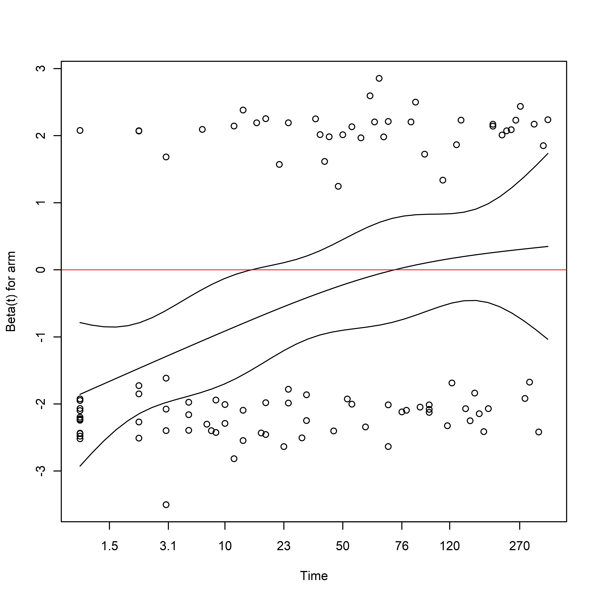

MISTIE III: Time-to-Event Outcome
================
Josh Betz (<jbetz@jhu.edu>), Kelly Van Lancker (<kvanlan3@jhu.edu>), and
Michael Rosenblum (<mrosen@jhu.edu>)


- <a href="#executive-summary" id="toc-executive-summary">Executive
  Summary</a>
- <a href="#covariate-adjusted-analysis-in-practice"
  id="toc-covariate-adjusted-analysis-in-practice">Covariate Adjusted
  Analysis in Practice</a>
  - <a href="#installing-rtools---compiling-packages-from-source"
    id="toc-installing-rtools---compiling-packages-from-source">Installing
    RTools - Compiling Packages from Source</a>
  - <a href="#installing-r-packages-from-cran"
    id="toc-installing-r-packages-from-cran">Installing R Packages from
    CRAN</a>
  - <a href="#installing-r-packages-from-github"
    id="toc-installing-r-packages-from-github">Installing R Packages from
    GitHub</a>
  - <a href="#loading-installed-packages"
    id="toc-loading-installed-packages">Loading Installed Packages</a>
- <a
  href="#simulated-minimally-invasive-surgery-for-intracerebral-hemorrhage"
  id="toc-simulated-minimally-invasive-surgery-for-intracerebral-hemorrhage">Simulated
  Minimally Invasive Surgery for Intracerebral Hemorrhage</a>
  - <a href="#baseline-demographics--stratum"
    id="toc-baseline-demographics--stratum">Baseline Demographics &amp;
    Stratum</a>
  - <a href="#outcomes" id="toc-outcomes">Outcomes</a>
  - <a href="#reference-level-for-treatment"
    id="toc-reference-level-for-treatment">Reference level for Treatment</a>
- <a href="#types-of-tests--estimators-time-to-event-outcomes"
  id="toc-types-of-tests--estimators-time-to-event-outcomes">Types of
  Tests &amp; Estimators: Time-to-Event Outcomes</a>
- <a href="#implementing-unadjusted-tests--models"
  id="toc-implementing-unadjusted-tests--models">Implementing Unadjusted
  Tests &amp; Models</a>
  - <a href="#kaplan-meier-survival-estimate-death"
    id="toc-kaplan-meier-survival-estimate-death">Kaplan-Meier Survival
    Estimate: Death</a>
  - <a href="#logrank-test" id="toc-logrank-test">Logrank Test</a>
  - <a href="#cox-proportional-hazards-model"
    id="toc-cox-proportional-hazards-model">Cox Proportional Hazards
    Model</a>
  - <a href="#restricted-mean-survival-time-survrm2rmst2"
    id="toc-restricted-mean-survival-time-survrm2rmst2">Restricted Mean
    Survival Time: <code>survRM2::rmst2</code></a>
  - <a href="#targeted-maximum-likelihood-estimator-tmle-adjrctsurvrct"
    id="toc-targeted-maximum-likelihood-estimator-tmle-adjrctsurvrct">Targeted
    Maximum Likelihood Estimator (TMLE): <code>adjrct::survrct</code></a>
- <a href="#covariate-adjusted-analyses"
  id="toc-covariate-adjusted-analyses">Covariate Adjusted Analyses</a>
  - <a href="#propensity-score" id="toc-propensity-score">Propensity
    Score</a>
  - <a href="#adjusted-cox-proportional-hazards-model"
    id="toc-adjusted-cox-proportional-hazards-model">Adjusted Cox
    Proportional Hazards Model</a>
  - <a href="#targeted-maximum-likelihood"
    id="toc-targeted-maximum-likelihood">Targeted Maximum Likelihood</a>

<style type="text/css">
.main-container {
  max-width: 100% !important;
  margin: auto;
}
</style>

## Executive Summary

Randomly allocating participants to treatment arms will tend to produce
groups that are initially comparable to one another across both observed
and unobserved factors. In any given randomized trial, there will be
some degree of imbalance in the distribution of baseline covariates
between treatment groups. When a variable is a strong predictor of the
outcome and is imbalanced across treatment arms, it represents a
potential confounding variable and source of bias, even if these
differences are not statistically significant (Assmann et al. 2000).
Confounding can be addressed both in the design phase of a trial, using
stratified randomization to lessen the potential for imbalance, and in
during the analysis phase, through covariate adjustment.

Covariate adjustment can lead to a more efficient trial, potentially
lowering the required sample size to detect a given treatment effect if
it exists, or provide greater precision (shorter confidence interval
widths and higher power) for the same sample size and treatment effect.
When stratified randomization is used, covariate adjustment is generally
suggested, but not always implemented, which can lead to reduced power
and precision (Kahan and Morris 2011). Accessible and practical
discussions of baseline balance, stratified randomized trials, and
adjusted analyses are also available to offer further explanation and
guidance to investigators (Kernan 1999; Assmann et al. 2000).

When using regression models for inference, it is important to
understand how model misspecification may affect statistical inference.
Fortunately, there are several approaches to covariate-adjusted analyses
whose validity does not depend on a correctly specified model, or
provide inference with greater robustness to misspecification than those
used in common practice.

**The focus of this template is on the analysis of time-to-event
outcomes.** This tutorial illustrates the use of covariate-adjusted
analysis in clinical trials using **synthetic data simulated to mimic
features of the MISTIE III trial.** This tutorial illustrates
calculating the restricted mean survival time (RMST) and survival
probability with and without adjustment for covariates. These methods
are contrasted against methods commonly used in observational studies
and randomized trials, such as the logrank test and Cox Proportional
Hazards model.

#### Using This Tutorial

This tutorial contains an example dataset as well as code to illustrate
how to perform covariate adjustment in practice for continuous and
binary outcomes using [R](https://www.r-project.org/). R is a free and
open source language and statistical computing environment.
[Rstudio](https://rstudio.com/) is a powerful development environment
for using the R language. The ability of R can be extended by
downloading software packages from the [Comprehensive R Archival Network
(CRAN)](https://cran.r-project.org/). In R, these packages can be
installed from the Comprehensive R Archival Network, or CRAN, using the
`install.packages()` command. In Rstudio IDE, there is a ‘Packages’ tab
that allows users to see which packages are installed, which packages
are currently in use, and install or update packages using a graphical
interface. Once the required packages are installed, data can be
downloaded from Github, and users can run the code on their own devices.

## Covariate Adjusted Analysis in Practice

Once R and Rstudio have been installed, additional packages must be
installed from CRAN or Github, and some tools may need to be installed
to compile packages from source code.

### Installing RTools - Compiling Packages from Source

Some R packages must be compiled from source code.
[RTools](https://cran.r-project.org/bin/windows/Rtools/) is a set of
software tools for compiling such R packages. Choose the appropriate
version of RTools for your version of R.

### Installing R Packages from CRAN

The following packages and their dependencies needs to be installed:

- [knitr](https://cran.r-project.org/web/packages/knitr/index.html) -
  Tools for literate programming: including code in reproducible reports
- [devtools](https://cloud.r-project.org/web/packages/devtools/index.html) -
  A suite of tools for R package development
- [tidyverse](https://www.tidyverse.org/packages/) - An ecosystem of
  packages for working with data
- [table1](https://cran.r-project.org/web/packages/table1/index.html) -
  Creating simple tabulations in aggregate and by treatment arm
- [survminer](https://cran.r-project.org/web/packages/survminer/index.html) -
  Creating plots of time-to-event data
- [survRM2](https://cran.r-project.org/web/packages/survRM2/index.html) -
  Calculating the restricted mean survival time (RMST) with and without
  covariate adjustment.

``` r
required_packages <-
  c("knitr",
    "devtools",
    "tidyverse",
    "table1",
    "survminer",
    "coxrobust",
    "survRM2"
  )

install.packages(required_packages)
```

**NOTE:** Packages only need to be installed once: after installation,
they can be updated using the ‘Packages’ tab in RStudio.

### Installing R Packages from GitHub

[Github](https://github.com/) is a platform for developing software and
documentation with version control. It is a common platform for R
package development, testing, reporting and addressing software issues.
Use `devtools::install_github` to install packages hosted on Github.

``` r
devtools::install_github("nt-williams/simul")
devtools::install_github("nt-williams/adjrct")
```

### Loading Installed Packages

Once the required packages are installed, they can be loaded using
`library()` command.

``` r
library(knitr) # Printing tables in reports
library(tidyverse) # Data manipulation: dplyr, tidyr
library(table1) # Creation of Summary tables
library(survival) # For AFT & Cox Proportional Hazards Models
library(survminer) # For Kaplan-Meier Plots
library(coxrobust) # For coxr: Robust Cox PH Model
library(survRM2) # For restricted mean survival times (RMST)
library(adjrct) # For TMLE estimates of RMST, Survival Probability
library(splines) # For adding smoothing splines
```

## Simulated Minimally Invasive Surgery for Intracerebral Hemorrhage

Data used in this example are simulated using data based on the
**M**inimally **I**nvasive **S**urgery with **T**hrombolysis in
**I**ntracerebral haemorrhage **E**vacuation trial ([MISTIE
III](https://doi.org/10.1016/s0140-6736(19)30195-3):
[NCT01827046](https://clinicaltrials.gov/show/NCT01827046)). In this
study, participants were randomized 1:1 to standard-of-care medical
management, or minimal invasive surgery with Alteplase for ICH removal.
Outcomes were measured at 30, 180, and 365-days post-randomization using
the Modified Rankin Scale (MRS). Survival was also assessed, with
patients administratively censored on the date of their final MRS
assessment.

A new synthetic dataset was created by resampling baseline covariates
from the original data with replacement. The columns in the synthetic
dataset were sequentially replaced using simulated values based on
predictions from a sequence of regression models based on the actual
study data.

- `sim_participant_id`: Patient id
- Baseline Covariates
  - `age`: Age in years
  - `male`: male sex
  - `hx_cvd`: cardiovascular disease history
  - `hx_hyperlipidemia`: hyperlipidemia history
  - `on_anticoagulants`: on anticoagulant medication
  - `on_antiplatelets`: on antiplatelet medication
  - `ich_location`: intracerebral hemorrhage location: (`Lobar`, `Deep`)
  - `ich_s_volume`: intracerebral hemorrhage volume on stability scan
  - `ivh_s_volume`: intraventricular hemorrhage volume on stability scan
  - `gcs_category`: presenting Glasgow Coma Score (GCS)
- Treatment:
  - `arm`: treatment arm
  - `ich_eot_volume`: intracerebral hemorrhage volume on
    end-of-treatment scan
- Outcome:
  - `mrs_30d`: MRS at 30 days (`0-3`, `4`, `5`, `6`)
  - `mrs_30d_complete`: MRS at 30 days if no data were missing
  - `mrs_180d`: MRS at 180 days (`0-2`, `3`, `4`, `5`, `6`)
  - `mrs_180d_complete`: MRS at 180 days if no data were missing
  - `mrs_365d`: MRS at 365 days (`0-1`, `2`, `3`, `4`, `5`, `6`)
  - `mrs_365d_complete`: MRS at 365 days if no data were missing
  - `days_on_study`: days until death or administrative censoring
  - `died_on_study`: participant died (`1`) or is censored (`0`)

The outcomes `mrs_30d`, `mrs_180d`, and `mrs_365d` contain missing
values: the actual values before the missingness mechanism is applied
are also included with the `_complete` suffix.

### Baseline Demographics & Stratum

Below are summary statistics of participant characteristics at baseline.

``` r
table1(
  ~ mrs_30d + mrs_180d +
    on_antiplatelets + ich_location + ich_s_volume + ivh_s_volume +
    gcs_category | arm, 
  data = sim_miii
)
```

### Outcomes

``` r
table1(
  ~ mrs_30d + mrs_180d + mrs_365d | arm, 
  data = sim_miii
)
```

### Reference level for Treatment

When the treatment is a `factor` variable, we can use the `levels()`
function to see the reference level (i.e. the comparator/control group):
it will appear as the first level.

``` r
# Check reference level
levels(sim_miii$arm)
```

    ## [1] "medical"  "surgical"

**Make sure that the reference level is appropriately chosen before
running analyses to avoid errors in interpretation and inference.**

------------------------------------------------------------------------

## Types of Tests & Estimators: Time-to-Event Outcomes

The Kaplan-Meier (K-M) estimate of the survival function is a ubiquitous
approach to estimating and visualizing the survival probability,
i.e. the probability of not having an event of interest, over a
follow-up period. The K-M estimator assumes that censoring is
independent of the event time within each treatment arm, which may be
violated if certain baseline characteristics, such as disease severity,
are associated with both the event time of interest and dropout (Dı́az et
al. 2018). This could occur if individuals with greater baseline
severity are more likely to have the event and more likely to drop out
before the event is observed.

The logrank test is perhaps the most common method for performing sample
size calculations and performing unadjusted comparisons of time-to-event
outcomes. The logrank test is valid if censoring is independent of the
treatment or independent of the event time in each treatment arm
(Lancker, Dukes, and Vansteelandt 2021). The logrank test is most
powerful under the proportional hazards assumption. When the
proportional hazards assumption is violated, a weight function can be
specified in a weighted logrank test to emphasize different domains of
the survival curve. For more on the use of weighted logrank tests to
address violations of the proportional hazards, see Lin and León (2017).

The Cox Proportional Hazards (PH) regression is the most common method
for performing covariate-adjusted comparisons of time-to-event outcomes
under the proportional hazards assumption. The logrank test is
equivalent to the Score test in a Cox PH model which only includes a
treatment indicator and no additional covariates. Inclusion of
covariates allows relaxation of the uninformative censoring assumption,
but raises concerns about the impact of model assumptions and
specification.

The validity of tests for the hypothesis of no treatment effect in
randomized experiments using the Cox PH model depends on the
relationship of censoring times to the treatment assignment and
covariates. If censoring times are conditionally independent of
treatment assignment given the covariates, or conditionally independent
of the covariates given the treatment assignment, tests are valid when
the sandwich variance estimator is used. However, if the model is
mispecified and the distribution of censoring times depends on both the
treatment and covariates, tests based on the Cox model will not be
valid, and alternatives should be considered (DiRienzo and Lagakos
2001).

When the proportional hazards assumption is violated, the estimates from
a Cox PH model represent a weighted average of the hazard functions over
time. The weights in this weighted average are determined by both the
survival in each group and the censoring distribution. This dependence
upon the censoring distribution makes it difficult to meaningfully
interpret the estimate when there are appreciable violations of the PH
assumption (Rudser, LeBlanc, and Emerson 2012).

Even in the situation when the proportional hazards assumption appears
to hold, the clinical interpretation of the hazard ratio is not
straightforward. In the absence of censoring, measures of a treatment
effect are usually based on summaries of the outcome distribution that
explicitly reference the scale of measurement of the outcome which
facilitate evaluation of clinical importance, such as the mean, median,
or proportion above or below a clinically meaningful threshold (Rudser,
LeBlanc, and Emerson 2012). The hazard function is the instantaneous
rate at which events occur, which changes over time, and does not
quantify the expected length of time until the event (Rudser, LeBlanc,
and Emerson 2012).

Since quantities such as survival probabilities (e.g. survival at 5
years), quantiles (e.g. median, 75<sup>th</sup> percentile), or the
restricted mean survival time (RMST, e.g. average time without an event
in the 5 yeras post randomization) explicitly reference the time frame
of events, they may be more clinically meaningful for comparing
treatments (Rudser, LeBlanc, and Emerson 2012). Survival probability and
RMST are interpretable under violations of the proportional hazards
assumption, and estimators for these quantities exist that are doubly
robust (i.e. consistent if either the censoring or survival
distributions are consistently estimated) and are at least as efficient
as the K-M estimator (Dı́az et al. 2018).

While covariate-adjusted hazard ratios can be obtained from a Cox PH
model, these are conditional treatment effects: they are the estimated
hazard ratio given all of the covariates in the model. Covariate
adjusted estimators of the survival probability and RMST are marginal
treatment effects, which are useful for assessing the public health
impact of an intervention on the intended use population. For more
information on estimands and estimators for survival data, see the pages
on
[estimands](https://jbetz-jhu.github.io/CovariateAdjustmentTutorial/blob/gh-pages/Estimands_of_Interest.html)
and [estimators and
models](https://jbetz-jhu.github.io/CovariateAdjustmentTutorial/blob/gh-pages/Estimators.html).

------------------------------------------------------------------------

## Implementing Unadjusted Tests & Models

### Kaplan-Meier Survival Estimate: Death

#### KM for Death - Time Scale: Days

``` r
time_to_death_km <-
  survfit(
    formula = Surv(time = days_on_study, event = died_on_study) ~ arm,
    data = sim_miii
  )

ggsurvplot(
  fit = time_to_death_km,
  conf.int = TRUE,
  risk.table = TRUE,
  xlab = "Days", 
  ylab = "Survival probability"
)
```


#### KM for Death - Stratified by `ich_location`

``` r
ggsurvplot(
  fit = time_to_death_km,
  conf.int = TRUE,
  facet.by = "ich_location",
  xlab = "Days", 
  ylab = "Survival probability"
) +
  theme(
    # Adjust Plot Labels for Readability
    axis.text.x = element_text(size = 18),
    axis.text.y = element_text(size = 18),
    axis.title.y = element_text(size = 26),
    axis.title.x = element_text(size = 26),
    strip.text = element_text(size = 26),
    legend.text = element_text(size = 22),
    legend.title = element_text(size = 22)
  )
```


### Logrank Test

The logrank test (and the G-rho family of rank-based test procedures)
can be obtained using `survival::survdiff`:

``` r
survival::survdiff(
  formula = Surv(time = days_on_study, event = died_on_study) ~ arm,
  data = sim_miii
)
```

    ## Call:
    ## survival::survdiff(formula = Surv(time = days_on_study, event = died_on_study) ~ 
    ##     arm, data = sim_miii)
    ## 
    ##                N Observed Expected (O-E)^2/E (O-E)^2/V
    ## arm=medical  250       64     49.6      4.19      8.06
    ## arm=surgical 250       40     54.4      3.82      8.06
    ## 
    ##  Chisq= 8.1  on 1 degrees of freedom, p= 0.005

### Cox Proportional Hazards Model

The Cox Proportional Hazards model can be fit using the
`survival::coxph` function. Robust standard errors can be utilized with
the argument `robust = TRUE`.

``` r
unadjusted_cox <-
  survival::coxph(
    formula = Surv(time = days_on_study, event = died_on_study) ~ arm,
    # Use Efron's Method for Tied Event Times
    ties = "efron",
    # Use Robust Standard Errors
    robust = TRUE,
    data = sim_miii
  )

summary(unadjusted_cox)
```

    ## Call:
    ## survival::coxph(formula = Surv(time = days_on_study, event = died_on_study) ~ 
    ##     arm, data = sim_miii, ties = "efron", robust = TRUE)
    ## 
    ##   n= 500, number of events= 104 
    ## 
    ##                coef exp(coef) se(coef) robust se      z Pr(>|z|)   
    ## armsurgical -0.5670    0.5672   0.2016    0.1995 -2.841  0.00449 **
    ## ---
    ## Signif. codes:  0 '***' 0.001 '**' 0.01 '*' 0.05 '.' 0.1 ' ' 1
    ## 
    ##             exp(coef) exp(-coef) lower .95 upper .95
    ## armsurgical    0.5672      1.763    0.3836    0.8387
    ## 
    ## Concordance= 0.575  (se = 0.024 )
    ## Likelihood ratio test= 8.16  on 1 df,   p=0.004
    ## Wald test            = 8.07  on 1 df,   p=0.004
    ## Score (logrank) test = 8.12  on 1 df,   p=0.004,   Robust = 8.03  p=0.005
    ## 
    ##   (Note: the likelihood ratio and score tests assume independence of
    ##      observations within a cluster, the Wald and robust score tests do not).

Assuming the proportional hazards assumption is correct, the hazard of
death in those in the surgical arm was 35% lower
(`(1 - 0.6464) = 0.3536`) than the medical management arm.

The Proportional Hazards (PH) assumption can be assessed using
`survival::cox.zph`:

``` r
unadjusted_cox_ph_test <- cox.zph(unadjusted_cox)

print(unadjusted_cox_ph_test)
```

    ##        chisq df      p
    ## arm     9.85  1 0.0017
    ## GLOBAL  9.85  1 0.0017

``` r
# Plot 
plot(cox.zph(unadjusted_cox))
```


These plots should show an approximately constant value over time when
the proportional hazards assumption holds.

### Restricted Mean Survival Time: `survRM2::rmst2`

``` r
with(
  sim_miii,
  survRM2::rmst2(
    time = days_on_study,
    status = died_on_study,
    arm = tx,
    tau = 90
  )
)
```

    ## 
    ## The truncation time: tau = 90  was specified. 
    ## 
    ## Restricted Mean Survival Time (RMST) by arm 
    ##                Est.    se lower .95 upper .95
    ## RMST (arm=1) 84.510 1.160    82.237    86.783
    ## RMST (arm=0) 75.744 1.932    71.957    79.531
    ## 
    ## 
    ## Restricted Mean Time Lost (RMTL) by arm 
    ##                Est.    se lower .95 upper .95
    ## RMTL (arm=1)  5.490 1.160     3.217     7.763
    ## RMTL (arm=0) 14.256 1.932    10.469    18.043
    ## 
    ## 
    ## Between-group contrast 
    ##                       Est. lower .95 upper .95 p
    ## RMST (arm=1)-(arm=0) 8.766     4.350    13.182 0
    ## RMST (arm=1)/(arm=0) 1.116     1.054     1.181 0
    ## RMTL (arm=1)/(arm=0) 0.385     0.235     0.630 0

The average survival time in the first 90 days was 83 days in the
surgical arm and 76 days in the medical arm: the difference in average
survival time (RMST) between arms in the first 90 months was 7.1 days.
The ratio of RMST between treatment and control was 1.09 (9% increase in
RMST).

### Targeted Maximum Likelihood Estimator (TMLE): `adjrct::survrct`

The first step in using `adjrct::survrct` is to compute the metadata
necessary for computing the model-robust estimates of restricted mean
survival time and survival probability: **NOTE: in this particular
dataset, this may take some time, considerably more than
`survRM2::rmst()`.**

``` r
surv_metadata_unadj <-
  adjrct::survrct(
    outcome.formula = Surv(days_on_study, died_on_study) ~ tx, 
    trt.formula = tx ~ 1,
    data = sim_miii,
  )
```

#### Unadjusted Restricted Mean Survival Time (RMST)

``` r
adjrct::rmst(
  metadata = surv_metadata_unadj,
  horizon = 90
)
```

The results here are in line with the RMST calculated using
`survRM2::rmst2()`.

#### Unadjusted Survival Probability

``` r
adjrct::survprob(
  metadata = surv_metadata_unadj,
  horizon = 90
)
```

    ## Warning: step size truncated due to increasing deviance

    ## Warning: step size truncated due to increasing deviance

    ## Warning: step size truncated due to increasing deviance

    ## Warning: step size truncated due to increasing deviance

The unadjusted survival probability in the first 90 days was 0.88 in the
in the surgical arm and 0.77 in the medical arm. The difference in the
probability of surviving the first 90 days between surgical and medical
was 0.11 (i.e an 11% lower risk of dying in the first 90 days in the
treatment arm relative to control).

------------------------------------------------------------------------

## Covariate Adjusted Analyses

### Propensity Score

``` r
ps_model <-
  mgcv::gam(
    formula =
      tx ~ s(age) + male + hx_cvd + hx_hyperlipidemia +
      on_anticoagulants + on_antiplatelets + ich_location +
      s(ich_s_volume) + s(ivh_s_volume) + gcs_category,
    data = sim_miii,
    family = binomial(link = "logit")
  )

summary(ps_model)
```

    ## 
    ## Family: binomial 
    ## Link function: logit 
    ## 
    ## Formula:
    ## tx ~ s(age) + male + hx_cvd + hx_hyperlipidemia + on_anticoagulants + 
    ##     on_antiplatelets + ich_location + s(ich_s_volume) + s(ivh_s_volume) + 
    ##     gcs_category
    ## 
    ## Parametric coefficients:
    ##                                Estimate Std. Error z value Pr(>|z|)  
    ## (Intercept)                    -0.17041    0.23550  -0.724   0.4693  
    ## male1. Male                     0.07898    0.20003   0.395   0.6930  
    ## hx_cvd1. Yes                    0.17986    0.28062   0.641   0.5216  
    ## hx_hyperlipidemia1. Yes        -0.37854    0.21745  -1.741   0.0817 .
    ## on_anticoagulants1. Yes        -0.27188    0.41718  -0.652   0.5146  
    ## on_antiplatelets1. Yes          0.44788    0.23563   1.901   0.0573 .
    ## ich_locationLobar              -0.08078    0.20635  -0.391   0.6955  
    ## gcs_category2. Moderate (9-12)  0.06881    0.23064   0.298   0.7654  
    ## gcs_category3. Mild (13-15)     0.36935    0.25002   1.477   0.1396  
    ## ---
    ## Signif. codes:  0 '***' 0.001 '**' 0.01 '*' 0.05 '.' 0.1 ' ' 1
    ## 
    ## Approximate significance of smooth terms:
    ##                   edf Ref.df Chi.sq p-value  
    ## s(age)          5.381  6.561 12.174  0.0757 .
    ## s(ich_s_volume) 1.000  1.001  0.001  0.9798  
    ## s(ivh_s_volume) 1.000  1.000  0.519  0.4715  
    ## ---
    ## Signif. codes:  0 '***' 0.001 '**' 0.01 '*' 0.05 '.' 0.1 ' ' 1
    ## 
    ## R-sq.(adj) =  0.0228   Deviance explained = 4.03%
    ## UBRE = 0.39596  Scale est. = 1         n = 500

### Adjusted Cox Proportional Hazards Model

``` r
adjusted_cox <-
  coxph(
    formula = Surv(days_on_study, died_on_study) ~ arm +
      # Covariates
      pspline(age) + male + hx_cvd + hx_hyperlipidemia +
      on_anticoagulants + on_antiplatelets + ich_location +
      pspline(ich_s_volume) + pspline(ivh_s_volume) + gcs_category,
    # Use Efron's Method for Tied Event Times
    ties = "efron",
    # Use Robust Standard Errors
    robust = TRUE,
    data = sim_miii
  )
```

Assuming the proportional hazards assumption holds, conditioning on age,
sex, antiplatelet and anticoagulant use, ICH location, and the volumes
of ICH and IVH on the stability scan, the hazard of death in those
receiving surgery was 21% lower (`(1 - exp(-0.241460)) = 0.2145198`)
than the medical arm. Note that this is also a conditional treatment
effect, not a marginal treatment effect.

``` r
cox.zph(
  fit = adjusted_cox
)
```

    ##                          chisq    df      p
    ## arm                   10.06992  0.99 0.0015
    ## pspline(age)           0.20280  4.02 0.9953
    ## male                   0.87577  0.99 0.3462
    ## hx_cvd                 0.00932  0.98 0.9197
    ## hx_hyperlipidemia      0.02266  0.99 0.8783
    ## on_anticoagulants      0.07419  0.99 0.7813
    ## on_antiplatelets       0.16014  0.99 0.6842
    ## ich_location           6.89229  1.00 0.0086
    ## pspline(ich_s_volume)  3.40417  4.01 0.4944
    ## pspline(ivh_s_volume)  0.07829  4.02 0.9993
    ## gcs_category           2.79527  1.99 0.2447
    ## GLOBAL                26.87130 20.96 0.1735

Here we can see departures from the proportional hazards assumption:

``` r
cox.zph(
  fit = adjusted_cox
) %>% 
  plot(var = "arm")
abline(h = 0, col = rgb(1, 0, 0, 0.75))
```



------------------------------------------------------------------------

### Targeted Maximum Likelihood

``` r
surv_metadata_adj <-
  adjrct::survrct(
    outcome.formula = Surv(days_on_study, died_on_study) ~ tx +
      age + male + hx_cvd + hx_hyperlipidemia +
      on_anticoagulants + on_antiplatelets + ich_location +
      ich_s_volume + ivh_s_volume + gcs_category,
    trt.formula =
      tx ~
      age + male + hx_cvd + hx_hyperlipidemia +
      on_anticoagulants + on_antiplatelets + ich_location +
      ich_s_volume + ivh_s_volume + gcs_category,
    data = sim_miii
  )
```

#### Calculate Restricted Mean Survival Time

``` r
rmst_metadata_adj <-
  adjrct::rmst(
    metadata = surv_metadata_adj,
    horizon = 90
  )

rmst_metadata_adj
```

    ## RMST Estimator: tmle

    ## Marginal RMST: E(min[T, 90] | A = a)

    ## Treatment Arm

    ## Estimate: 84.28

    ## Std. error: 1.19

    ## 95% CI: (81.95, 86.61)

    ## Control Arm

    ## Estimate: 76.65

    ## Std. error: 1.77

    ## 95% CI: (73.17, 80.13)

    ## Treatment Effect: E(min[T, 90] | A = 1) - E(min[T, 90] | A = 0)

    ## Additive effect

    ## Estimate: 7.63

    ## Std. error: 2.11

    ## 95% CI: (3.49, 11.77)

``` r
rmst_metadata_adj_table <-
  with(
    rmst_metadata_adj$estimates[[1]],

    bind_rows(
      data.frame(
        Arm = "Treatment",
        Estimate = arm1,
        SE = arm1.std.error,
        LCL = arm1.conf.low,
        UCL = arm1.conf.high
      ),

      data.frame(
        Arm = "Control",
        Estimate = arm0,
        SE = arm0.std.error,
        LCL = arm0.conf.low,
        UCL = arm0.conf.high
      ),
      data.frame(
        Arm = "Treatment - Control",
        Estimate = theta,
        SE = std.error,
        LCL = theta.conf.low,
        UCL = theta.conf.high
      )
    )
  )

kable(
  x = rmst_metadata_adj_table,
  caption = "TMLE covariate-adjusted estimates of Restricted Mean Survival Time.",
  digits = 2
)
```

| Arm                 | Estimate |   SE |   LCL |   UCL |
|:--------------------|---------:|-----:|------:|------:|
| Treatment           |    84.28 | 1.19 | 81.95 | 86.61 |
| Control             |    76.65 | 1.77 | 73.17 | 80.13 |
| Treatment - Control |     7.63 | 2.11 |  3.49 | 11.77 |

TMLE covariate-adjusted estimates of Restricted Mean Survival Time.

The covariate-adjusted RMST is slightly smaller than the unadjusted
estimate for the surgical group (81.5 vs 83.0), and slightly larger for
the medical group (77.3 vs. 75.9). As a result, there is a slightly
smaller covariate-adjusted difference in RMST at 90 days compared to the
unadjusted estimate (4.2 vs 7.1).

#### Calculate Survival Probability

``` r
survival_metadata_adj <-
  adjrct::survprob(
    metadata = surv_metadata_adj,
    horizon = 90
  )
```

    ## Warning: step size truncated due to increasing deviance

    ## Warning: step size truncated due to increasing deviance

    ## Warning: step size truncated due to increasing deviance

    ## Warning: step size truncated due to increasing deviance

``` r
survival_metadata_adj
```

    ## Survival Probability Estimator: tmle

    ## Marginal Survival Probability: Pr(T > 90 | A = a)

    ## Treatment Arm

    ## Estimate: 0.89

    ## Std. error: 0.02

    ## 95% CI: (0.85, 0.93)

    ## Control Arm

    ## Estimate: 0.81

    ## Std. error: 0.02

    ## 95% CI: (0.77, 0.86)

    ## Treatment Effect: Pr(T > 90 | A = 1) - Pr(T > 90 | A = 0)

    ## Additive effect

    ## Estimate: 0.08

    ## Std. error: 0.03

    ## 95% CI: (0.02, 0.14)

``` r
survival_metadata_adj_table <-
  with(
    survival_metadata_adj$estimates[[1]],

    bind_rows(
      data.frame(
        Arm = "Treatment",
        Estimate = arm1,
        SE = arm1.std.error,
        LCL = arm1.conf.low,
        UCL = arm1.conf.high
      ),

      data.frame(
        Arm = "Control",
        Estimate = arm0,
        SE = arm0.std.error,
        LCL = arm0.conf.low,
        UCL = arm0.conf.high
      ),
      data.frame(
        Arm = "Treatment - Control",
        Estimate = theta,
        SE = std.error,
        LCL = theta.conf.low,
        UCL = theta.conf.high
      )
    )
  )

kable(
  x = survival_metadata_adj_table,
  caption = "TMLE covariate-adjusted estimates of survival probability.",
  digits = 2
)
```

| Arm                 | Estimate |   SE |  LCL |  UCL |
|:--------------------|---------:|-----:|-----:|-----:|
| Treatment           |     0.89 | 0.02 | 0.85 | 0.93 |
| Control             |     0.81 | 0.02 | 0.77 | 0.86 |
| Treatment - Control |     0.08 | 0.03 | 0.02 | 0.14 |

TMLE covariate-adjusted estimates of survival probability.

The covariate-adjusted survival probability is slightly smaller than the
unadjusted estimate for the surgical group (0.86 vs 0.88), and slightly
larger for the medical group (0.79 vs. 0.77). As a result, there is a
slightly smaller covariate-adjusted difference in survival probability
at 90 days compared to the unadjusted estimate (0.07 vs 0.11).

<div id="refs" class="references csl-bib-body hanging-indent">

<div id="ref-Assmann2000" class="csl-entry">

Assmann, Susan F, Stuart J Pocock, Laura E Enos, and Linda E Kasten.
2000. “Subgroup Analysis and Other (Mis)uses of Baseline Data in
Clinical Trials.” *The Lancet* 355 (9209): 1064–69.
<https://doi.org/10.1016/s0140-6736(00)02039-0>.

</div>

<div id="ref-DiRienzo2001" class="csl-entry">

DiRienzo, A. G., and S. W. Lagakos. 2001. “Effects of Model
Misspecification on Tests of No Randomized Treatment Effect Arising from
Coxs Proportional Hazards Model.” *Journal of the Royal Statistical
Society: Series B (Statistical Methodology)* 63 (4): 745–57.
<https://doi.org/10.1111/1467-9868.00310>.

</div>

<div id="ref-Diaz2018" class="csl-entry">

Dı́az, Iván, Elizabeth Colantuoni, Daniel F. Hanley, and Michael
Rosenblum. 2018. “Improved Precision in the Analysis of Randomized
Trials with Survival Outcomes, Without Assuming Proportional Hazards.”
*Lifetime Data Analysis* 25 (3): 439–68.
<https://doi.org/10.1007/s10985-018-9428-5>.

</div>

<div id="ref-Kahan2011" class="csl-entry">

Kahan, Brennan C., and Tim P. Morris. 2011. “Improper Analysis of Trials
Randomised Using Stratified Blocks or Minimisation.” *Statistics in
Medicine* 31 (4): 328–40. <https://doi.org/10.1002/sim.4431>.

</div>

<div id="ref-Kernan1999" class="csl-entry">

Kernan, W. 1999. “Stratified Randomization for Clinical Trials.”
*Journal of Clinical Epidemiology* 52 (1): 19–26.
<https://doi.org/10.1016/s0895-4356(98)00138-3>.

</div>

<div id="ref-VanLancker2021" class="csl-entry">

Lancker, Kelly Van, Oliver Dukes, and Stijn Vansteelandt. 2021.
“Principled Selection of Baseline Covariates to Account for Censoring in
Randomized Trials with a Survival Endpoint.” *Statistics in Medicine* 40
(18): 4108–21. <https://doi.org/10.1002/sim.9017>.

</div>

<div id="ref-Lin2017" class="csl-entry">

Lin, Ray S., and Larry F. León. 2017. “Estimation of Treatment Effects
in Weighted Log-Rank Tests.” *Contemporary Clinical Trials
Communications* 8 (December): 147–55.
<https://doi.org/10.1016/j.conctc.2017.09.004>.

</div>

<div id="ref-Rudser2012" class="csl-entry">

Rudser, Kyle D., Michael L. LeBlanc, and Scott S. Emerson. 2012.
“Distribution-Free Inference on Contrasts of Arbitrary Summary Measures
of Survival.” *Statistics in Medicine* 31 (16): 1722–37.
<https://doi.org/10.1002/sim.4505>.

</div>

</div>
